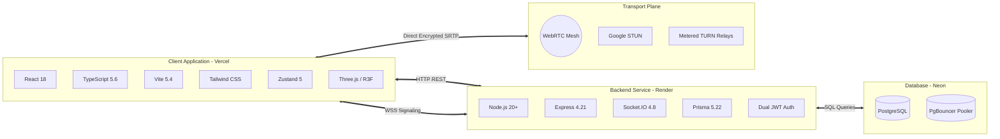

# CALLIVO — Meet. Connect. Collaborate.

<div align="center">

[](https://callivo.vercel.app)
[](https://callivo-f1n8.onrender.com/health)
[](https://github.com/hardik563/CALLIVO)
[](https://www.typescriptlang.org/)
[](https://react.dev/)
[](https://webrtc.org/)

**A modern, production-grade real-time video conferencing web application engineered for zero-install, low-latency virtual collaboration.**

[Explore Live Demo](https://callivo.vercel.app) • [View Architecture Docs](docs/02_ARCHITECTURE.md) • [Interview Guide](docs/18_INTERVIEW_QUESTIONS.md) • [Viva Q&A](docs/19_VIVA_QA.md)

</div>

---

## 📖 Comprehensive Documentation Suite (`docs/`)

The repository includes complete, study-grade technical documentation designed for deep architectural reviews, technical interviews, and academic viva examinations:

| Document | Topic | Description |
| :--- | :--- | :--- |
| [**01. Project Overview**](docs/01_PROJECT_OVERVIEW.md) | Executive Summary | Vision, objectives, user flows, and subsystem boundaries. |
| [**02. Architecture**](docs/02_ARCHITECTURE.md) | System Design | Mesh P2P WebRTC, signaling vs. media separation, and ICE/STUN/TURN. |
| [**03. Technology Stack**](docs/03_TECHNOLOGY_STACK.md) | Verified Dependencies | Full dependency matrix, rationale, and implemented vs. planned features. |
| [**04. Frontend Guide**](docs/04_FRONTEND.md) | React & Three.js | Component tree, custom hooks, responsive grid logic, and 3D scenes. |
| [**05. Backend Guide**](docs/05_BACKEND.md) | Node.js & Express | Immediate port binding, middleware stack, and service layer architecture. |
| [**06. Database Schema**](docs/06_DATABASE.md) | Prisma & PostgreSQL | Exhaustive guide to all 26 relational models and Neon PgBouncer pooling. |
| [**07. Authentication**](docs/07_AUTHENTICATION.md) | Security & JWT | Dual-token rotation (15m access + 7d refresh cookie) and bcrypt hashing. |
| [**08. WebRTC Deep Dive**](docs/08_WEBRTC.md) | Media Transport | Transceivers, dual audio pipeline, autoplay watchdog, and bug retrospectives. |
| [**09. Signaling Protocol**](docs/09_SIGNALING.md) | Socket.IO Events | Authoritative dictionary of all Socket.IO signaling and moderation events. |
| [**10. REST API Reference**](docs/10_API_DOCUMENTATION.md) | API Endpoints | Detailed specifications for all active HTTP endpoints across all modules. |
| [**11. State Management**](docs/11_STATE_MANAGEMENT.md) | Zustand Stores | Complete guide to all 9 Zustand stores and reactive state subscriptions. |
| [**12. Client-Side Routing**](docs/12_ROUTING.md) | React Router v6 | Page routing catalog, layout shells, route head branding, and fallbacks. |
| [**13. Real-Time Features**](docs/13_REAL_TIME_FEATURES.md) | In-Call Features | Active speaker detection, speech-to-text live captions, screen share, and Q&A. |
| [**14. Production Deployment**](docs/14_DEPLOYMENT.md) | Multi-Cloud DevOps | Vercel edge frontend, Render container backend, and Neon PostgreSQL. |
| [**15. Security Architecture**](docs/15_SECURITY.md) | Threat Modeling | CORS validation, Helmet headers, rate limiting, and DTLS/SRTP encryption. |
| [**16. Project Structure**](docs/16_PROJECT_STRUCTURE.md) | Codebase Anatomy | Complete annotated directory tree of both client and server monorepo. |
| [**17. End-to-End Data Flows**](docs/17_DATA_FLOW.md) | Sequence Traces | Step-by-step traces for signup, login, WebRTC negotiation, and call media. |
| [**18. Interview Questions**](docs/18_INTERVIEW_QUESTIONS.md) | Career Preparation | 50+ deep interview questions with short answers and CALLIVO code examples. |
| [**19. Academic Viva Q&A**](docs/19_VIVA_QA.md) | B.Tech Exam Prep | 75+ beginner-friendly viva questions and natural spoken explanations. |
| [**20. Troubleshooting Runbook**](docs/20_TROUBLESHOOTING.md) | Post-Mortems | 10 real production incidents, root causes, and field diagnostic procedures. |
| [**21. Learning Roadmap**](docs/21_LEARNING_ROADMAP.md) | 12-Level Curriculum | Structured self-study path from web basics to WebRTC and WebGL mastery. |

---

## 🚀 Key Platform Features

- **Direct P2P WebRTC Conferencing:** Ultra-low latency, hardware-accelerated audio/video streams with DTLS/SRTP encryption.
- **Dual-Output Resilient Audio:** Combines background HTML5 `<audio>` DOM nodes with Web Audio API `AudioContext.destination` routing to guarantee incoming speech is heard even in background tabs.
- **Autoplay Watchdog & Recovery:** Traps browser autoplay restrictions and renders an interactive unblocking prompt to resume audio streams seamlessly.
- **High-Definition Screen Sharing:** Dynamic video track replacement (`replaceTrack`) enables instantaneous screen sharing without SDP renegotiation.
- **Host Governance & Waiting Room Lobby:** Passcode protection, host-admitted waiting room queue, room locking, force mute, and participant ejection.
- **In-Call Collaboration:** Real-time public and private chat whispers, floating emoji reactions with particle confetti, hand raising with host alerts, and interactive Q&A upvoting.
- **Live Speech Captions:** Real-time speech-to-text transcription via the Web Speech API broadcast to all room attendees.
- **Real-Time Network Diagnostics:** Live telemetry modal displaying Round Trip Time (RTT), packet loss percentage, audio jitter (ms), negotiation direction (`sendrecv`), and active ICE candidate IP/protocol pairs.
- **3D Spatial Meeting Interface:** Interactive Three.js / React Three Fiber virtual conference room and animated 3D landing hero.
- **Complete Productivity Suite:** Personal dashboard, meeting scheduler, integrated monthly calendar, user address book, direct messaging, and helpdesk support ticketing.

---

## 🛠️ Technology Stack



---

## 💻 Local Development Setup

### Prerequisites
- **Node.js**: Version 20.0.0 or higher
- **npm**: Version 9.0.0 or higher
- **Git**: Installed on your system

### 1. Clone the Repository
```bash
git clone https://github.com/hardik563/CALLIVO.git
cd CALLIVO
```

### 2. Configure Environment Variables
Copy the template configuration to `.env`:
```bash
cp .env.example .env
```
*(By default, `.env.example` is pre-configured to run with local SQLite and Google STUN without requiring cloud credentials).*

### 3. Install Dependencies
```bash
# Install root/frontend dependencies
npm install

# Install backend dependencies
cd server && npm install && cd ..
```

### 4. Initialize Database Schema
CALLIVO automatically provisions SQLite for local development:
```bash
cd server
npm run prisma:generate
npm run prisma:push
cd ..
```

### 5. Start the Development Servers
In two separate terminal windows:

**Terminal 1 (Backend API & Socket.IO Server):**
```bash
npm run server:dev
# Server starts on http://localhost:5000
```

**Terminal 2 (Frontend Client with Vite HMR):**
```bash
npm run dev
# Client starts on http://localhost:5173
```

Open your browser and navigate to `http://localhost:5173`.

---

## 📦 Production Deployment Architecture

CALLIVO is architectured for multi-cloud deployment:

```
GitHub Repository (main branch)
       │
       ├─────────────────────────────────┐
       ▼                                 ▼
Vercel Edge Network               Render Web Service
(Frontend SPA Client)             (Backend Node Container)
https://callivo.vercel.app        https://callivo-f1n8.onrender.com
       │                                 │
       │                                 ▼
       │                          Neon Cloud Database
       │                          (PostgreSQL Serverless)
       ▼                                 │
Direct WebRTC Mesh Audio/Video ◄─────────┘
(STUN: stun.l.google.com / TURN: openrelay.metered.ca)
```

1. **Frontend (Vercel):** Build command `npm run build:client`, publishing directory `dist/`. Configured with `vercel.json` rewrites for SPA routing.
2. **Backend (Render):** Deployed via `render.yaml`. Binds port `5000` in <1s for instant health checks. Connects to Neon PostgreSQL with automatic `pgbouncer=true` sanitization.
3. **Database (Neon):** Managed serverless PostgreSQL database with automated branching and connection pooling.

---

## 🔒 Security & Privacy

- **End-to-End Media Encryption:** WebRTC mandates DTLS/SRTP encryption; all audio, video, and screen share frames are encrypted end-to-end between browsers.
- **Dual-Token Authentication:** 15-minute access tokens paired with 7-day refresh tokens stored in `HttpOnly`, `SameSite=Lax`, `Secure` cookies.
- **Password Protection:** Credentials hashed with `bcryptjs` using 10 adaptive salt rounds.
- **CORS & Header Hardening:** Strict dynamic origin validation combined with Helmet security headers.
- **SQL Injection Defense:** All queries parameterized through Prisma ORM; zero raw string SQL interpolation.
- **Input Sanitization:** Every API endpoint payload is strictly validated using Zod schemas.

---

## 🔮 Future Improvements (Enterprise Roadmap)

- **Selective Forwarding Unit (SFU):** Integrating `mediasoup` or LiveKit to scale beyond mesh limits to 50+ concurrent participants per room.
- **Server-Side Composite Recording:** Headless browser workers to record and composite meeting grids into full-fidelity MP4 files.
- **End-to-End Encrypted Chat:** Implementing client-side Signal Protocol keys for in-call text and file distribution.
- **Two-Factor Authentication (2FA):** Authenticator app TOTP verification for enhanced account security.

---

## 👤 Author

**Hardik**  
- **GitHub:** [@hardik563](https://github.com/hardik563)  
- **Project:** [https://github.com/hardik563/CALLIVO](https://github.com/hardik563/CALLIVO)  
- **Live Demo:** [https://callivo.vercel.app](https://callivo.vercel.app)

---

<div align="center">
  <sub>Built with modern WebRTC, TypeScript, React, Express, and Prisma. Distributed under the MIT License.</sub>
</div>
