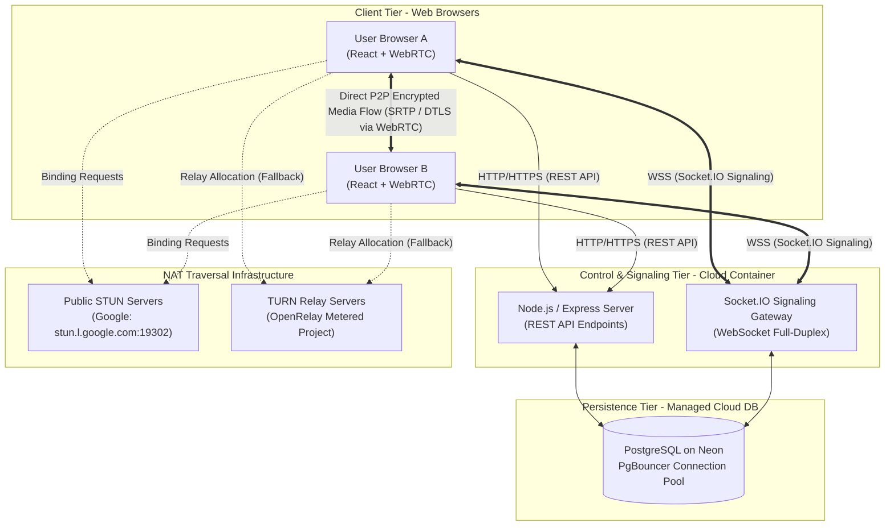
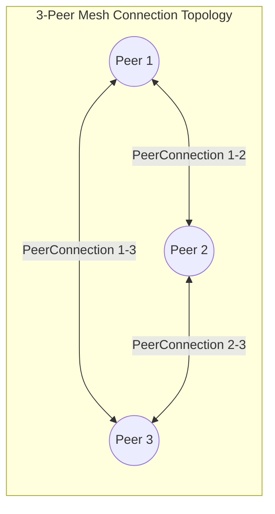

# 02. Architecture & Systems Design — CALLIVO

> **CALLIVO — Meet. Connect. Collaborate.**  
> Technical Architecture Reference Document

---

## 1. High-Level Architectural Diagram

CALLIVO employs a decoupled, multi-tiered architecture separating application data/control planes from media transport planes:



---

## 2. The Current CALLIVO Topology: Mesh Peer-to-Peer (P2P)

CALLIVO currently implements a **Full Mesh Peer-to-Peer (P2P)** WebRTC architecture.



### Architectural Characteristics of Current Implementation
- Every participant establishes an independent `RTCPeerConnection` with every other participant in the meeting room.
- For $N$ active participants, each browser maintains $N - 1$ outbound media streams and receives $N - 1$ inbound media streams.
- **Why Mesh P2P Was Chosen:**
  - **Zero Media Server Operating Costs:** Media streams never transit the backend server; bandwidth and CPU costs for video transcoding are offloaded to client hardware.
  - **Minimal Latency:** Packets travel across the shortest physical path between peers without intermediary server buffering.
  - **High Privacy:** Audio and video streams are end-to-end encrypted with DTLS/SRTP directly between user browsers.
- **Scope Note on SFU/MCU:**
  > [!NOTE]
  > Centralized media routing engines such as SFUs (Selective Forwarding Units, e.g., mediasoup or Janus) are **documented/planned for future enterprise scaling**, but are **not currently implemented** in the active codebase. All active meetings execute over direct WebRTC Mesh P2P.

---

## 3. The Two Fundamental Planes: Signaling vs. Media

A common point of confusion in real-time web development is the relationship between Socket.IO and WebRTC. CALLIVO enforces a strict separation:

| Dimension | Control & Signaling Plane | Media Transport Plane |
| :--- | :--- | :--- |
| **Technology** | Socket.IO (WebSockets / HTTP Polling) | WebRTC (`RTCPeerConnection`) |
| **Endpoint** | Browser $\longleftrightarrow$ Node.js Server | Browser $\longleftrightarrow$ Browser (Direct) |
| **Payload** | Small JSON text strings (SDP, ICE candidates, chat, mute events) | Heavy binary audio/video frames (Opus, VP8, H.264) |
| **Protocol** | TCP (WebSocket over TLS) | UDP (SRTP / SRTCP over DTLS) |
| **Latency Priority** | Reliable, ordered delivery | Immediate, low-latency delivery (tolerates minor packet drop) |
| **Server Bandwidth** | Kilobytes per minute | Megabytes per minute (Offloaded completely from server) |

---

## 4. Why Signaling is Required

Browsers cannot simply dial another browser's IP address on the internet. Browsers do not know:
1. What public IP address and port the remote user is reachable at (due to NAT routers and firewalls).
2. What media capabilities (codecs, resolutions, encryption keys) the remote browser supports.
3. When another user has arrived in or departed from a virtual meeting room.

**Signaling** is the discovery and negotiation mechanism that bridges this gap. It operates through the central server like an operator connecting a telephone call. Once the credentials and routing addresses are exchanged, the server steps out of the media pathway, allowing the browsers to talk directly.

---

## 5. Why Media Does NOT Travel Through Socket.IO

Running video and audio streams through Socket.IO or the Node.js backend is an architectural anti-pattern for real-time conferencing:
1. **TCP Head-of-Line Blocking:** Socket.IO runs over TCP. If a single audio packet is dropped by Wi-Fi interference, TCP halts the entire stream until that packet is retransmitted. This causes noticeable freezes and audio delays. WebRTC uses UDP; if a frame is lost, it drops it and renders the next frame immediately.
2. **Server CPU & Memory Exhaustion:** Decoding, packaging, and relaying video feeds for dozens of concurrent calls would require massive multi-core server clusters. WebRTC offloads all video encoding/decoding to the user's hardware graphics acceleration.
3. **Latency:** Passing video through an intermediary server adds an unavoidable physical detour (Browser $\rightarrow$ Server $\rightarrow$ Browser) compared to direct peer routing.

---

## 6. WebRTC Core Concepts Explained

### A. SDP (Session Description Protocol)
SDP is a standard text format that describes media exchange properties:
- What audio codecs are available (e.g., Opus at 48 kHz stereo)?
- What video codecs are supported (e.g., VP8, H.264 profile 42e01f)?
- What network setup is proposed (e.g., `bundle-policy`, `rtcp-mux`)?
- What are the cryptographic fingerprints for DTLS encryption?

**The Negotiation Dance:**
1. **Offer:** Browser A generates an SDP Offer declaring: *"Here are my codecs, encryption keys, and audio/video tracks. I propose we communicate."*
2. **Answer:** Browser B receives the offer, inspects it, and generates an SDP Answer: *"I accept Opus and VP8. Here are my corresponding encryption fingerprints and track settings."*

### B. ICE (Interactive Connectivity Establishment)
ICE is a standardized framework used by WebRTC to find the best possible network path between two browsers. Most personal computers and phones sit behind private routers using NAT (Network Address Translation). ICE tests multiple candidate paths simultaneously:
1. **Host Candidates:** Direct local IP addresses on the local area network (LAN/Wi-Fi).
2. **Server Reflexive Candidates (STUN):** Public IP addresses and port numbers discovered by querying an external STUN server.
3. **Relay Candidates (TURN):** Public relay server IP addresses used when direct connections are completely blocked by symmetric NATs or firewalls.

### C. STUN (Session Traversal Utilities for NAT)
A STUN server acts like a public mirror. A browser sends a lightweight UDP packet to `stun:stun.l.google.com:19302`. The STUN server replies: *"I received your packet from public IP `203.0.113.45` on port `54320`."* The browser now knows its own public identity and advertises this as an ICE candidate to peers.
- STUN is **lightweight**, **free of charge**, and **never touches meeting media**.

### D. TURN (Traversal Using Relays around NAT)
When users sit behind restrictive corporate firewalls or **Symmetric NATs** (common on 4G/5G mobile networks), direct peer-to-peer UDP transmission is forbidden by the router. 
- In this scenario, ICE falls back to a **TURN relay server**. Both browsers establish an authenticated connection to the TURN server, which acts as a dumb packet forwarder.
- CALLIVO includes configured STUN servers and automated fallback to high-availability TURN relays (`turn:openrelay.metered.ca`).

### E. DTLS & SRTP (Security and Encryption)
WebRTC mandates end-to-end encryption at all times:
- **DTLS (Datagram Transport Layer Security):** A handshake protocol modeled after TLS/HTTPS, used to securely negotiate ephemeral cryptographic keys over UDP.
- **SRTP (Secure Real-time Transport Protocol):** The encrypted wrapper that protects all real-time voice and video packets traveling across the internet. Eavesdroppers cannot inspect or tamper with media packets in flight.

---

## 7. Complete WebRTC Negotiation Lifecycle in CALLIVO

```mermaid
sequenceDiagram
    autonumber
    participant Alice as Browser A (Offerer)
    participant Server as Socket.IO Signaling Gateway
    participant Bob as Browser B (Answerer)

    Note over Alice,Bob: Step 1: Join & Discovery
    Alice->>Server: socket.emit('meeting:join', { meetingId: 'clv-123', name: 'Alice' })
    Server->>Alice: socket.emit('room:joined', { existingParticipants: [] })

    Bob->>Server: socket.emit('meeting:join', { meetingId: 'clv-123', name: 'Bob' })
    Server->>Bob: socket.emit('room:joined', { existingParticipants: [Alice] })
    Server->>Alice: socket.emit('participant:joined', { socketId: Bob.id, name: 'Bob' })

    Note over Alice,Bob: Step 2: Offerer Initialization
    Bob->>Bob: Create RTCPeerConnection for Alice<br/>Add audio & video transceivers ('sendrecv')<br/>Create local SDP Offer
    Bob->>Server: socket.emit('webrtc:offer', { toSocketId: Alice.id, sdp: offer })
    Server->>Alice: socket.emit('webrtc:offer', { fromSocketId: Bob.id, sdp: offer })

    Note over Alice,Bob: Step 3: Answerer Handling
    Alice->>Alice: setRemoteDescription(offer)<br/>Attach local mic & cam tracks to transceivers<br/>Set direction = 'sendrecv'<br/>Create local SDP Answer
    Alice->>Server: socket.emit('webrtc:answer', { toSocketId: Bob.id, sdp: answer })
    Server->>Bob: socket.emit('webrtc:answer', { fromSocketId: Alice.id, sdp: answer })

    Note over Alice,Bob: Step 4: Finalize Offer/Answer
    Bob->>Bob: setRemoteDescription(answer)<br/>Drain any queued ICE candidates

    Note over Alice,Bob: Step 5: ICE Candidate Exchange (Concurrent)
    Bob->>Server: socket.emit('webrtc:ice-candidate', { toSocketId: Alice.id, candidate })
    Server->>Alice: socket.emit('webrtc:ice-candidate', { fromSocketId: Bob.id, candidate })
    Alice->>Alice: addIceCandidate(candidate)

    Alice->>Server: socket.emit('webrtc:ice-candidate', { toSocketId: Bob.id, candidate })
    Server->>Bob: socket.emit('webrtc:ice-candidate', { fromSocketId: Alice.id, candidate })
    Bob->>Bob: addIceCandidate(candidate)

    Note over Alice,Bob: Step 6: Direct Media Flow
    Alice<<==>>Bob: Direct P2P SRTP Audio (Opus) & Video (VP8) Streams
```
