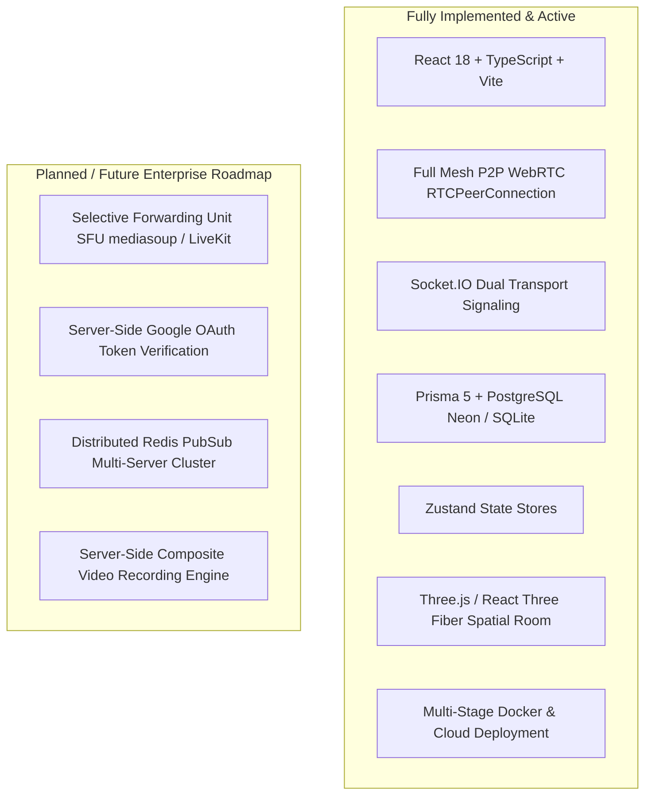

# 03. Technology Stack & Dependencies — CALLIVO

> **CALLIVO — Meet. Connect. Collaborate.**  
> Comprehensive Verification of Production Technologies & Tooling

---

## 1. Primary Technology Matrix

Every technology documented below has been verified against the active source code, `package.json`, and deployment manifests.

| Technology | Purpose | Where Used in Codebase | Why Used in CALLIVO |
| :--- | :--- | :--- | :--- |
| **React 18** | Frontend UI Framework | Entire client application (`src/`) | Component-based reactivity, high render performance via virtual DOM, and rich ecosystem compatibility with WebRTC & WebGL. |
| **TypeScript 5.6** | Static Type Checking | Both Frontend (`src/`) & Backend (`server/src/`) | Prevents runtime bugs, guarantees strict type safety across WebSockets/WebRTC payloads, and documents data structures automatically. |
| **Vite 5.4** | Frontend Build Tool & Dev Server | Root configuration (`vite.config.ts`), client bundling | Instant Hot Module Replacement (HMR) during local development and optimized Rollup-based tree-shaking for production builds. |
| **Node.js 20+ (Alpine)** | Backend JavaScript Runtime | Server application (`server/src/`), Docker container | Event-driven, non-blocking I/O model ideally suited for handling high-concurrency WebSocket connections and REST requests. |
| **Express 4.21** | HTTP Backend Web Framework | Server routing, middleware stack (`server/src/app.ts`) | Battle-tested, minimalist framework offering granular control over HTTP pipelines, custom error handling, and static SPA serving. |
| **Socket.IO 4.8** | Real-Time Full-Duplex Signaling | Signaling gateway (`server/src/signaling/`), Client manager (`src/lib/socket.ts`) | Automatic WebSocket upgrade, connection fallbacks (long-polling), room abstractions, and reliable broadcast event distribution. |
| **WebRTC API** | Browser Peer-to-Peer Media Streaming | Client media engine (`src/lib/webrtc.ts`) | W3C standard for ultra-low latency, hardware-accelerated, end-to-end encrypted audio and video delivery without plugins. |
| **Prisma 5.22** | Object-Relational Mapping (ORM) | Server database layer (`server/prisma/`, `server/src/db/prisma.ts`) | Type-safe database queries, automated SQL migration management, and auto-generated TypeScript database client. |
| **PostgreSQL** | Relational Database Engine | Production persistence layer | ACID-compliant storage for users, complex meeting relationships, calendar events, messages, and security audit logs. |
| **Neon Serverless Postgres** | Cloud Database Infrastructure | Production cloud database (`render.yaml`) | Autoscaling PostgreSQL with built-in PgBouncer connection pooling, fast cold starts, and high reliability. |
| **SQLite 3** | Local Database Engine | Development persistence layer (`server/dev.db`) | Zero-configuration, file-based database enabling developers to run and test CALLIVO offline without installing PostgreSQL. |
| **Tailwind CSS 3.4** | Utility-First CSS Framework | UI component styling (`src/components/`, `src/index.css`) | Rapid, consistent design system execution with dark-mode utilities, arbitrary values, and zero runtime overhead. |
| **Zustand 5.0** | Client State Management | Client stores (`src/stores/authStore.ts`, `meetingStore.ts`, etc.) | Unopinionated, lightweight, boilerplate-free state management outside the React lifecycle, ideal for asynchronous WebRTC state. |
| **React Router 6.28** | Client-Side SPA Routing | Navigation system (`src/App.tsx`) | Declarative nested routing, layout wrapping, protected route redirection, and dynamic meeting URL parameters. |
| **Framer Motion 11.11** | Declarative Animation Library | Modals, drawers, landing transitions (`src/components/`) | Fluid 60fps micro-interactions, layout morphing, spring physics, and animated entry/exit transitions. |
| **Three.js 0.170** | 3D Graphics WebGL Engine | Spatial meeting room (`src/components/three/`) | Native WebGL rendering of dynamic 3D virtual environments, meshes, lighting, and camera positions. |
| **React Three Fiber 8.17** | React Renderer for Three.js | Spatial meeting canvas (`src/components/three/Hero3D.tsx`) | Declarative component abstraction for Three.js scenes, managing scene graphs and render loops inside React. |
| **@react-three/drei 9.120** | Helper Suite for React Three Fiber | 3D cameras, controls, materials (`src/components/three/`) | Reusable abstractions such as `OrbitControls`, `Float`, `MeshReflectorMaterial`, and environment shaders. |
| **React Hook Form 7.53** | Form State & Interaction Engine | Login, Signup, Schedule forms (`src/pages/`) | High-performance, un-controlled form inputs with minimal re-renders and clean validation hook integrations. |
| **Zod 3.23** | TypeScript-First Schema Validation | Server request validators (`server/src/auth/`, etc.), forms | Runtime schema enforcement and automatic type inference, preventing malformed payloads from penetrating backend services. |
| **Lucide React 0.46** | Modern Iconography | UI icons across entire client (`src/components/`) | Consistent, clean SVG vector icons with zero external asset loading overhead. |
| **bcryptjs 2.4** | Cryptographic Password Hashing | Authentication service (`server/src/auth/auth.service.ts`) | Slow, computationally expensive hashing with automated salt generation to resist rainbow-table attacks. |
| **jsonwebtoken 9.0** | Token-Based Session Security | Auth middleware & controllers (`server/src/common/auth.middleware.ts`) | Stateless, cryptographically signed claims for user identification, permissions, and session validation. |
| **Helmet 8.0** | HTTP Security Headers | Express middleware (`server/src/app.ts`) | Configures security headers to mitigate XSS, clickjacking, and cross-origin resource exploitation. |
| **express-rate-limit 7.4**| API & Auth Request Throttling | Server rate limiter (`server/src/common/rateLimiter.ts`) | Protects public endpoints from brute-force authentication attacks and denial-of-service attempts. |
| **canvas-confetti 1.9** | Celebration Animation Engine | Meeting milestones, room entry (`src/pages/MeetingRoomPage.tsx`) | Lightweight canvas particles for user delight during meeting achievements and reactions. |
| **Docker** | Containerization Runtime | Multi-stage build (`Dockerfile`) | Guarantees identical runtime environments between local development, CI/CD, and production cloud servers. |
| **Vercel** | Edge Frontend Cloud Platform | Production client hosting (`vercel.json`) | Global CDN asset caching, automatic HTTPS, and instant Git-based preview deployments. |
| **Render** | Managed Cloud Container Platform | Production backend server (`render.yaml`) | Zero-configuration Node.js container hosting with automated HTTPS, environment variable injection, and health monitoring. |
| **GitHub** | Source Version Control & CI/CD | Code repository | Collaborative Git branch workflows, pull requests, and automated deployment webhooks. |

---

## 2. Infrastructure & Auxiliary Libraries

### Database Provider Synchronization Tooling
- **`sync-db-provider.cjs` (`server/scripts/sync-db-provider.cjs`):**
  - Custom Node.js synchronization script executed before Prisma generation.
  - Dynamically inspects `process.env.DATABASE_URL`. If the URL begins with `postgres://` or `postgresql://`, it modifies `schema.prisma` datasource provider to `postgresql`. If it begins with `file:`, it sets it to `sqlite`.
  - Enables developers to clone the repository and run immediately without manual schema editing.

### Production Container Orchestration
- **`start-production.cjs` (`server/scripts/start-production.cjs`):**
  - Initializes the container runtime, sanitizes Neon PgBouncer connection parameters, and launches the Express server with immediate port binding.

### Email Notification Engine
- **Resend SDK (`server/src/email/email.service.ts`):**
  - Integrated via `resend` npm package for transactional password reset emails and verification links.
  - Fallback: Gracefully logs formatted simulation links to the console in development when an API key is not configured.

---

## 3. Technology Status: Implemented vs. Planned

To maintain absolute technical honesty during interviews and project evaluations, the following distinction must be recognized:

- **WebRTC Architecture:** Current implementation is **Full Mesh P2P**. SFU/mediasoup is an enterprise scaling target for >10 participants per room.
- **Cache / PubSub:** The server configuration includes `REDIS_URL` support, but current production operates with an **in-memory room registry Map** because the server runs as a unified single-instance container.
- **Authentication:** Dual JWT tokens with bcrypt password hashing are fully implemented. Google login currently operates via client-side credential federation passing profile data to `/api/auth/google`, rather than backend Google API OAuth2 client ID verification.
