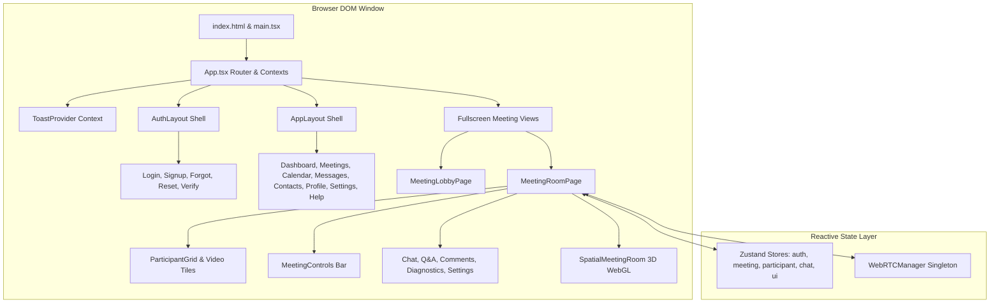

# 04. Frontend Architecture & Component Guide — CALLIVO

> **CALLIVO — Meet. Connect. Collaborate.**  
> Comprehensive Technical Guide to the React SPA Client

---

## 1. Frontend Architecture Overview

CALLIVO's frontend is constructed as a Single Page Application (SPA) leveraging **React 18**, **TypeScript 5.6**, and **Vite 5.4**. The frontend design follows a modular component hierarchy that cleanly isolates presentation from state management and WebRTC media mechanics.



---

## 2. Directory Structure (`src/`)

```
src/
├── components/          # Modular, reusable UI components
│   ├── auth/            # Authentication layout cards and banners
│   ├── dashboard/       # Dashboard modal dialogs (e.g., JoinMeetingModal)
│   ├── landing/         # Marketing landing components & 3D room showcase
│   ├── meeting/         # Core in-call conferencing components
│   ├── profile/         # Profile management & avatar cropping
│   ├── three/           # Three.js / React Three Fiber 3D scene graphs
│   └── ui/              # Design system atoms (Button, Modal, Drawer, etc.)
├── data/                # Static configuration & fallback mock constants
├── hooks/               # Custom React lifecycle & hardware hooks
├── layouts/             # Page structural shells (AppLayout, AuthLayout)
├── lib/                 # Core browser APIs (webrtc.ts, socket.ts, api.ts)
├── pages/               # Top-level routable screen views (19 pages)
├── stores/              # Zustand global reactive state stores (9 stores)
├── types/               # Shared TypeScript domain interfaces
├── App.tsx              # Root router declaration and branding handler
├── index.css            # Tailwind CSS utility imports and custom styling
└── main.tsx             # React DOM root bootstrapping
```

---

## 3. Core Meeting Components Deep Dive

### A. `MeetingControls.tsx` (`src/components/meeting/MeetingControls.tsx`)
- **Purpose:** The primary floating command bar docked at the bottom of the active meeting room, allowing participants to toggle audio/video hardware, initiate screen sharing, view participants, open chat, trigger emoji bursts, and leave/end the meeting.
- **Props / Inputs:**
  - `isAudioMuted: boolean`
  - `isVideoOff: boolean`
  - `isScreenSharing: boolean`
  - `isHandRaised: boolean`
  - `isRecording: boolean`
  - `unreadChatCount: number`
  - `participantCount: number`
  - `onToggleAudio: () => void`
  - `onToggleVideo: () => void`
  - `onToggleScreenShare: () => void`
  - `onToggleHand: () => void`
  - `onToggleChat: () => void`
  - `onToggleParticipants: () => void`
  - `onToggleSettings: () => void`
  - `onLeaveMeeting: () => void`
  - `onEndMeetingForAll?: () => void`
  - `isHost: boolean`
- **Internal State:** Dropdown toggle state for reaction pickers, audio device sub-menus, audio unlock recovery buttons, and leave confirmation dialogs.
- **Important Logic:**
  - Detects if browser autoplay has been blocked via `webrtcManager.isAudioAutoplayBlocked` and dynamically renders a glowing yellow **"Unmute Audio"** recovery pill.
  - Implements responsive folding: on mobile viewports (<768px), non-essential buttons collapse into a secondary "More Actions" sheet.
- **Where Used:** Mounted inside [MeetingRoomPage.tsx](file:///c:/Users/hardi/OneDrive/Desktop/CALLIVO/src/pages/MeetingRoomPage.tsx).

---

### B. `ParticipantTile.tsx` (`src/components/meeting/ParticipantTile.tsx`)
- **Purpose:** Renders an individual participant's live video stream, audio activity indicator, display badge, network quality icon, and contextual action menu.
- **Props / Inputs:**
  - `participant: ParticipantState` (name, avatar, role, audio/video status, socketId)
  - `stream?: MediaStream` (local camera feed or remote WebRTC peer stream)
  - `isLocal: boolean`
  - `isSpeaking: boolean`
  - `isDominantSpeaker: boolean`
  - `onPin?: () => void`
  - `onSpotlight?: () => void`
  - `isHost: boolean`
- **Internal State:** Video loading state, hover action visibility, device orientation calculation.
- **Important Logic:**
  - Directly binds `videoRef.current.srcObject = stream` inside a `useEffect` hook.
  - Uses `playsInline` and `autoPlay` to guarantee iOS Safari and Android Chrome compatibility.
  - When video is turned off (`participant.isVideoOff === true`), it smoothly cross-fades into an animated avatar with initials and an audio wave ring.
  - Renders a glowing emerald border when `isSpeaking` evaluates to true (calculated via Web Audio API frequency analysis).
- **Where Used:** Rendered iteratively inside `ParticipantGrid.tsx`.

---

### C. `ParticipantGrid.tsx` (`src/components/meeting/ParticipantGrid.tsx`)
- **Purpose:** Automatically calculates the optimal CSS grid layout based on the number of active participants and screen aspect ratio.
- **Props / Inputs:**
  - `participants: ParticipantState[]`
  - `localStream: MediaStream | null`
  - `remoteStreams: Map<string, MediaStream>`
  - `activeSpeakerId: string | null`
  - `pinnedParticipantId: string | null`
- **Important Logic:**
  - If a participant is pinned or sharing a screen, switches to **Stage Mode**: large primary viewport with a horizontal carousel of smaller thumbnail tiles at the bottom.
  - If no one is pinned, dynamically calculates CSS Grid templates:
    - 1 participant: Full screen ($1 \times 1$)
    - 2 participants: Side-by-side or stacked ($1 \times 2$)
    - 3–4 participants: $2 \times 2$ grid
    - 5–6 participants: $3 \times 2$ grid
    - 7+ participants: Auto-wrapping fluid grid.
- **Where Used:** Core display container inside [MeetingRoomPage.tsx](file:///c:/Users/hardi/OneDrive/Desktop/CALLIVO/src/pages/MeetingRoomPage.tsx).

---

### D. `ConnectionDiagnosticsModal.tsx` (`src/components/meeting/ConnectionDiagnosticsModal.tsx`)
- **Purpose:** Provides complete real-time engineering telemetry for the active WebRTC connection, allowing users to troubleshoot network degradation.
- **Props / Inputs:**
  - `isOpen: boolean`
  - `onClose: () => void`
- **Internal State:** Polls `webrtcManager.getDiagnostics()` every 1.5 seconds.
- **Metrics Displayed:**
  - **Connection State:** `connected`, `connecting`, `failed`
  - **Round Trip Time (RTT):** Milliseconds latency with color-coded warning thresholds
  - **Packet Loss:** Inbound percentage calculated from RTP sequence numbers
  - **Audio Bitrate:** Outbound TX and Inbound RX throughput in Kilobits per second (Kbps)
  - **Audio Packets Lost & Jitter:** Precise jitter calculation in milliseconds
  - **Audio Transceiver Direction:** Verified negotiation state (`sendrecv`, `recvonly`, etc.)
  - **Audio Element Status:** Live DOM playback status (`PLAYING` vs `PAUSED`)
  - **Selected ICE Candidate Pair:** Local IP/port, remote IP/port, protocol (UDP/TCP), and candidate type (`host`, `srflx`, `relay`).
- **Where Used:** Opened from the meeting info button in [MeetingRoomPage.tsx](file:///c:/Users/hardi/OneDrive/Desktop/CALLIVO/src/pages/MeetingRoomPage.tsx).

---

### E. `CaptionsOverlay.tsx` (`src/components/meeting/CaptionsOverlay.tsx`)
- **Purpose:** Transcribes spoken audio into live subtitles using the Web Speech Recognition API (`webkitSpeechRecognition`) and broadcasts subtitles to all peers via Socket.IO.
- **Props / Inputs:**
  - `isEnabled: boolean`
  - `meetingId: string`
  - `localUserName: string`
- **Internal State:** Rolling array of recent caption blocks with timestamps, speaker names, and fade-out timers.
- **Important Logic:**
  - Binds to speech recognition `result` events, emitting `captions:transcript` events to the signaling server.
  - Renders a translucent high-contrast subtitle overlay near the bottom third of the video container.
- **Where Used:** [MeetingRoomPage.tsx](file:///c:/Users/hardi/OneDrive/Desktop/CALLIVO/src/pages/MeetingRoomPage.tsx).

---

### F. Drawers: `ChatDrawer.tsx`, `ParticipantsDrawer.tsx`, `QnADrawer.tsx`, `CommentsDrawer.tsx`
- **`ChatDrawer.tsx`:** Manages real-time text chat with public broadcast and private peer-to-peer whispering. Includes automatic scroll-to-bottom and unread badge counting.
- **`ParticipantsDrawer.tsx`:** Lists all attendees, host badges, waiting room entries (with Admit/Reject buttons), hand-raise status, and host moderation actions (Force Mute, Stop Video, Remove, Promote Co-host).
- **`QnADrawer.tsx`:** Structured question-and-answer board with upvoting, pinned questions, and host answer responses backed by REST persistence.
- **`CommentsDrawer.tsx`:** Real-time meeting notes and commentary feed allowing attendees to post time-stamped feedback during presentations.

---

### G. 3D Spatial Visualizations (`src/components/three/`)
- **`Hero3D.tsx`:** Renders an interactive 3D WebGL scene on the landing page featuring a floating conference hub, orbiting holographic participant nodes, dynamic ambient point lights, and mouse-reactive parallax.
- **`SpatialMeetingRoom.tsx`:** A 3D virtual boardroom where participant video streams are mapped onto 3D video screens arranged around a circular conference table in virtual space.
- **`VideoPanel3D.tsx`:** Renders an individual 3D mesh surface textured dynamically with a participant's HTML5 `<video>` element using Three.js `VideoTexture`.

---

## 4. Custom React Hooks (`src/hooks/`)

| Hook | Purpose | Implementation Details |
| :--- | :--- | :--- |
| **`useMediaStream`** | Hardware camera & microphone management | Calls `navigator.mediaDevices.getUserMedia`, handles hardware permission prompts, manages track enabled/disabled state, and exposes device selection lists. |
| **`useDisplayMedia`** | Screen sharing capture | Calls `navigator.mediaDevices.getDisplayMedia`, binds `track.onended` to automatically revert to camera video when the user stops sharing via browser chrome controls. |
| **`useAudioMeter`** | Real-time audio volume analysis | Creates an `AudioContext` and `AnalyserNode`, samples frequency data at 60fps, and returns an amplitude level between 0 and 100 for volume meters. |
| **`useKeybindings`** | Keyboard accessibility shortcuts | Listens for global key shortcuts: `Space` (push-to-talk), `Alt+M` (mute toggle), `Alt+V` (camera toggle), `Alt+S` (screen share toggle), and `Alt+C` (chat drawer). |

---

## 5. UI Design System & Accessibility

1. **Design Tokens & Palette:**
   - Backgrounds: Dark slate/neutral tones (`#0b0d10`, `#13171f`, `#1e293b`).
   - Accents: Emerald green (`#10b981`), Cyan (`#06b6d4`), Violet (`#8b5cf6`).
   - Glassmorphism: Semi-transparent backdrop blur (`backdrop-blur-md bg-slate-900/80 border border-slate-800`).
2. **Typography:** Modern clean sans-serif typography utilizing high-readability system font stacks and geometric layout metrics.
3. **Accessibility (a11y):**
   - High-contrast text exceeding WCAG AA standards.
   - Descriptive `aria-label` attributes on all icon-only control buttons.
   - Visible keyboard focus rings (`focus:ring-2 focus:ring-emerald-500`).
   - Live speech captions for hearing-impaired participants.
