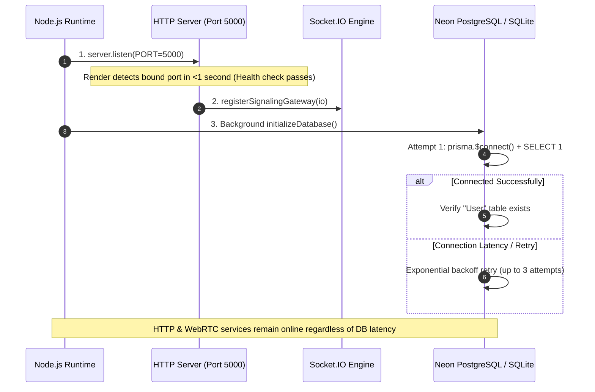

# 05. Backend Architecture & Server Guide — CALLIVO

> **CALLIVO — Meet. Connect. Collaborate.**  
> Technical Reference for the Node.js / Express / Socket.IO Backend Server

---

## 1. Backend Architecture Overview

CALLIVO's backend is a high-performance **Node.js 20+** application written in **TypeScript 5.6**, utilizing **Express 4.21** for REST API services and **Socket.IO 4.8** for real-time WebRTC signaling and meeting state synchronization.

```mermaid
graph TD
    subgraph Network Ingress
        ClientReq[Client HTTP Requests & WebSockets]
    end

    subgraph Express Application Pipeline
        ClientReq --> Security[Helmet & CORS Middleware]
        Security --> Parsers[JSON & URL-encoded Body Parsers 100MB]
        Parsers --> RequestLogger[API Request Performance Logger]
        RequestLogger --> RateLimiters[API & Auth Rate Limiters]
        
        RateLimiters --> Health[/health Endpoint]
        RateLimiters --> IceRoute[/api/webrtc/ice-servers Endpoint]
        RateLimiters --> APIRoutes[Modular API Route Handlers]
        RateLimiters --> StaticAssets[Uploads & SPA Client Static Fallback]
        
        APIRoutes --> Controllers[Controller Layer Req/Res Validation]
        Controllers --> Services[Service Layer Core Business Logic]
        Services --> PrismaClient[Prisma ORM Client]
        
        APIRoutes -. Error .-> CentralErrorHandler[Centralized Error Middleware]
    end

    subgraph Socket.IO Signaling Pipeline
        ClientReq <== WSS ==> SocketIO[Socket.IO Server Instance]
        SocketIO --> SocketAuth[JWT Handshake & Guest Identity Middleware]
        SocketAuth --> SignalingGateway[Signaling Gateway Event Handlers]
        SignalingGateway --> InMemRooms[In-Memory Room Registry Map]
        SignalingGateway --> PrismaClient
    end

    subgraph Persistence Layer
        PrismaClient <--> PostgreSQL[PostgreSQL on Neon / SQLite Dev]
    end
```

---

## 2. Backend Folder Structure (`server/`)

```
server/
├── prisma/
│   ├── dev.db                 # SQLite database file (local development only)
│   └── schema.prisma          # Authoritative Prisma data schema (26 models)
├── scripts/
│   ├── start-production.cjs   # Production container bootstrap & Neon sanitizer
│   ├── sync-db-provider.cjs   # Dynamic PostgreSQL vs SQLite schema provider sync
│   └── test_signaling_production.cjs # Automated Socket.IO integration probe
├── src/
│   ├── app.ts                 # Express app initialization, middleware, routes
│   ├── index.ts               # Server entry point: HTTP bind & DB initialization
│   ├── auth/                  # Authentication controllers, services, DTOs
│   ├── calendar/              # Meeting calendar event endpoints & queries
│   ├── common/                # Middleware: auth, rate limiting, error handling
│   ├── config/                # Environment variable loader & defaults
│   ├── contacts/              # User contact relationship management
│   ├── db/                    # Prisma client singleton & connection optimizer
│   ├── email/                 # Transactional email service (Resend API)
│   ├── helpdesk/              # Support ticketing system controllers & services
│   ├── meetings/              # Meeting lifecycle, participants, Q&A, comments
│   ├── messages/              # Direct messaging and conversation threads
│   ├── notifications/         # User in-app notifications
│   ├── recordings/            # Call recording metadata & upload storage
│   ├── settings/              # User preferences & audio/video device configs
│   ├── signaling/             # Socket.IO signaling gateway & room registry
│   ├── test-platform.ts       # Backend unit & integration test runner
│   └── users/                 # User profiles, avatar binary upload & search
├── package.json               # Backend npm package dependencies & scripts
└── tsconfig.json              # TypeScript compiler configuration
```

---

## 3. Server Entry Point & Bootstrap Pipeline (`server/src/index.ts`)

The server entry point initializes the HTTP server, attaches the Socket.IO instance, and establishes database connectivity:



### Key Engineering Features in `index.ts`:
1. **Immediate Port Binding:** The HTTP server binds `PORT` immediately before initiating database handshakes. This guarantees cloud hosting platforms (e.g., Render) detect an active web listener in less than 1 second, eliminating deployment timeout failures.
2. **Asynchronous Non-Blocking Database Initialization:** Database connectivity is handled asynchronously in the background with a bounded 10-second connection timeout and up to 3 automatic retries.
3. **Graceful Degradation:** If the remote cloud database experiences transient network latency, the WebRTC signaling gateway and static SPA file server remain 100% operational for in-flight meetings.

---

## 4. Middleware Pipeline (`server/src/app.ts`)

Every HTTP request passes through a sequence of protective and utility middleware:

1. **Helmet Security Headers (`helmet`):**
   - Configured with `crossOriginResourcePolicy: false` and `contentSecurityPolicy: false` to ensure browser STUN, TURN, WebSocket protocols, and remote media blobs are never blocked.
2. **CORS (Cross-Origin Resource Sharing):**
   - Implements dynamic origin validation (`isAllowedOrigin`) allowing requests from local development ports (`localhost:*`), Vercel preview domains (`*.vercel.app`), Cloudflare tunnel domains (`*.trycloudflare.com`), and explicitly configured `CLIENT_URL` values.
   - Sets `credentials: true` to support secure HTTP-only refresh token cookies.
3. **Payload Parsers:**
   - `express.json({ limit: '100mb' })` and `express.urlencoded({ extended: true, limit: '100mb' })` support high-resolution avatar image uploads and client-recorded meeting video uploads.
4. **Request Logging:**
   - Intercepts incoming requests and logs method, route, status code, and duration (e.g., `[API] GET /api/meetings 200 (14ms)`).
5. **Rate Limiting (`express-rate-limit`):**
   - Global API limiter: 500 requests per 15-minute window per IP.
   - Auth limiter: 30 requests per 15-minute window to protect login/signup from brute-force attempts.
   - Helpdesk limiter: 20 ticket submissions per 15-minute window to mitigate spam.

---

## 5. Centralized Error Handling & Validation

### A. Custom Error Class (`server/src/common/error.middleware.ts`)
```typescript
export class AppError extends Error {
  public statusCode: number;
  public isOperational: boolean;

  constructor(message: string, statusCode: number = 500) {
    super(message);
    this.statusCode = statusCode;
    this.isOperational = true;
    Error.captureStackTrace(this, this.constructor);
  }
}
```

### B. Zod Schema Validation
All request bodies entering sensitive endpoints are validated using Zod schemas before reaching the service layer:
```typescript
const RegisterSchema = z.object({
  name: z.string().min(2, 'Name must be at least 2 characters'),
  email: z.string().email('Invalid email address'),
  password: z.string().min(6, 'Password must be at least 6 characters'),
  phone: z.string().optional(),
  avatar: z.string().optional(),
});
```
When validation fails, Zod throws an error that is captured by the centralized error middleware, returning a structured 400 Bad Request response with exact field issue descriptions.

---

## 6. Authentication Middleware (`server/src/common/auth.middleware.ts`)

1. **`authenticateToken` / `requireAuth`:**
   - Extracts the Bearer token from the `Authorization: Bearer <token>` header.
   - Verifies token validity using `jwt.verify(token, config.jwt.secret)`.
   - Attaches decoded user claims (`req.user = { userId, id, email, role }`) to the Express request object.
   - Rejects unauthenticated requests with `401 Unauthorized`.
2. **`optionalAuth`:**
   - Extracts and verifies token if present, allowing guest users to access public meetings while identifying authenticated users for host privilege resolution.

---

## 7. Static Asset Serving & SPA Fallback

The backend serves a dual role in production containers:
1. **Uploads Directory (`/uploads`):**
   - Statically serves user avatars (`/uploads/avatars/`) and meeting recordings (`/uploads/recordings/`).
2. **SPA Client Fallback:**
   - If the pre-compiled frontend bundle exists in `/app/dist` (or `../dist`), Express serves static assets (`index.html`, JS, CSS) with aggressive 1-hour caching.
   - Implements a wildcard fallback (`app.get('*')`) that returns `index.html` for any client-side routes (e.g., `/dashboard`, `/room/:id`), enabling browser page refreshes without 404 errors.

---

## 8. Health & Diagnostic Endpoints

### `GET /health`
- **Purpose:** Cloud container uptime monitoring (Render, Docker, Kubernetes).
- **Authentication:** Public (no auth required).
- **Response Payload:**
  ```json
  {
    "status": "healthy",
    "service": "CALLIVO Backend API",
    "uptime": 1420.35,
    "timestamp": "2026-09-13T11:45:00.000Z"
  }
  ```

### `GET /api/webrtc/ice-servers`
- **Purpose:** Dynamically delivers STUN and TURN server configuration to connecting browsers.
- **Authentication:** Public.
- **Response:** Combines configured Google STUN servers with high-availability TURN relay endpoints (`openrelayproject`), enabling NAT traversal across restrictive corporate firewalls.
