# 06. Database Schema & Data Modeling — CALLIVO

> **CALLIVO — Meet. Connect. Collaborate.**  
> Exhaustive Reference to the Prisma ORM Schema & Relational Data Store

---

## 1. Database Architecture Overview

CALLIVO utilizes **Prisma 5.22** as its Object-Relational Mapper (ORM), interfacing with **PostgreSQL on Neon** in production and **SQLite 3** for local offline development.

```mermaid
erDiagram
    User ||--o{ Session : "has"
    User ||--o{ RefreshToken : "owns"
    User ||--o{ EmailVerification : "requests"
    User ||--o{ PasswordReset : "requests"
    User ||--o{ Meeting : "hosts"
    User ||--o{ MeetingParticipant : "participates"
    User ||--o{ MeetingInvite : "receives"
    User ||--o{ WaitingRoomEntry : "queues"
    User ||--o{ Contact : "maintains"
    User ||--o{ ContactRequest : "sends/receives"
    User ||--o{ Message : "authors"
    User ||--o{ CalendarEvent : "schedules"
    User ||--o{ Notification : "receives"
    User ||--o{ Reaction : "emits"
    User ||--o{ HelpdeskTicket : "files"
    User ||--o| UserSettings : "configures"
    User ||--o{ Device : "logs"
    User ||--o{ AuditLog : "triggers"

    Meeting ||--o{ MeetingParticipant : "includes"
    Meeting ||--o{ MeetingInvite : "dispatches"
    Meeting ||--o{ WaitingRoomEntry : "holds"
    Meeting ||--o{ Message : "records"
    Meeting ||--o{ Recording : "stores"
    Meeting ||--o{ Reaction : "captures"
    Meeting ||--o{ Question : "contains"
    Meeting ||--o{ MeetingComment : "collects"
    Meeting ||--o{ MeetingFile : "shares"
    Meeting ||--o{ ParticipantReport : "receives"

    Question ||--o{ QuestionVote : "receives"
    Conversation ||--o{ Message : "groups"
```

---

## 2. Dynamic Provider Synchronization (`sync-db-provider.cjs`)

To eliminate deployment friction and prevent Git conflicts between local development and cloud production, CALLIVO utilizes an automated pre-generation hook (`server/scripts/sync-db-provider.cjs`):
1. Reads `process.env.DATABASE_URL`.
2. If the URL begins with `postgres://` or `postgresql://`, it modifies `schema.prisma` to use `provider = "postgresql"`.
3. If the URL begins with `file:`, it sets `provider = "sqlite"`.
4. Executes automatically prior to `prisma generate` and `prisma db push`.

### Neon Connection Pooling & PgBouncer
In production environments, Neon PostgreSQL utilizes PgBouncer for transaction-level connection pooling. The server runtime automatically sanitizes the connection string (`server/src/db/prisma.ts`):
- If the hostname includes `-pooler`, ensures `?pgbouncer=true` is present to disable prepared statements that conflict with transaction pooling.
- Appends `connect_timeout=15` and `sslmode=require` to prevent database connection hangs during container startup.

---

## 3. Comprehensive Model Catalog (All 26 Models)

### Model 1: `User`
- **Purpose:** Central entity representing registered users, account credentials, profile data, and organizational roles.
- **Important Fields:** `id` (UUID), `email` (unique, indexed), `passwordHash`, `name`, `phone`, `avatar`, `bio`, `timezone`, `role` (`user` | `admin`), `status` (`online` | `in_meeting` | `offline`), `lastSeenAt`, `emailVerifiedAt`.
- **Relationships:** Links to sessions, refresh tokens, hosted meetings, participations, contacts, messages, calendar events, settings, and audit logs.
- **Why it exists:** Core identity foundation required for authentication, authorization, and personalized meeting experiences.

### Model 2: `Session`
- **Purpose:** Tracks active web login sessions for users.
- **Important Fields:** `id`, `userId`, `token` (unique), `ipAddress`, `userAgent`, `expiresAt`, `createdAt`.
- **Relationships:** Belongs to `User` (cascade delete).
- **Why it exists:** Allows remote session revocation and security monitoring of active browser logins.

### Model 3: `RefreshToken`
- **Purpose:** Stores cryptographically hashed long-lived refresh tokens for secure JWT rotation.
- **Important Fields:** `id`, `userId`, `tokenHash` (unique), `revoked` (Boolean), `expiresAt`, `createdAt`.
- **Relationships:** Belongs to `User` (cascade delete).
- **Why it exists:** Enables issuing short-lived access tokens (15 minutes) while maintaining seamless 7-day logins without storing raw refresh tokens in the database.

### Model 4: `EmailVerification`
- **Purpose:** Manages one-time tokens for account email verification.
- **Important Fields:** `id`, `userId`, `token` (unique), `expiresAt`, `usedAt`.
- **Relationships:** Belongs to `User`.
- **Why it exists:** Confirms user email authenticity to prevent spam and identity spoofing.

### Model 5: `PasswordReset`
- **Purpose:** Manages time-limited tokens for account password recovery.
- **Important Fields:** `id`, `userId`, `token` (unique), `expiresAt`, `usedAt`.
- **Relationships:** Belongs to `User`.
- **Why it exists:** Facilitates secure self-service password resets dispatched via transactional email.

### Model 6: `Meeting`
- **Purpose:** Authoritative record of video conference rooms, access rules, security policies, and scheduling.
- **Important Fields:** `id` (String primary key, e.g., `clv-849-2180`), `title`, `passcode`, `hostId`, `scheduledAt`, `durationMinutes`, `waitingRoom`, `muteOnEntry`, `allowScreenShare`, `allowChat`, `allowReactions`, `isLocked`, `status` (`scheduled` | `active` | `ended` | `cancelled`).
- **Relationships:** Belongs to host `User`; has many participants, invites, waiting room entries, recordings, Q&A questions, comments, and files.
- **Why it exists:** The central domain entity of CALLIVO around which real-time audio/video conferences are orchestrated.

### Model 7: `MeetingParticipant`
- **Purpose:** Audit record of an individual's presence and hardware state in a specific meeting session.
- **Important Fields:** `id`, `meetingId`, `userId` (nullable for guests), `socketId`, `displayName`, `avatarUrl`, `role` (`host` | `co_host` | `participant` | `guest`), `joinedAt`, `leftAt`, `isMuted`, `isCameraOff`, `isHandRaised`, `connection` (`excellent` | `good` | `poor`).
- **Relationships:** Belongs to `Meeting` and optional `User`.
- **Why it exists:** Persists historical attendance records, durations, and in-call states for post-meeting analytics and active attendee lists.

### Model 8: `MeetingInvite`
- **Purpose:** Represents email invitations sent to prospective meeting participants.
- **Important Fields:** `id`, `meetingId`, `userId`, `email`, `status` (`pending` | `accepted` | `declined`).
- **Relationships:** Belongs to `Meeting` and `User`.
- **Why it exists:** Tracks RSVP status and manages calendar invite dispatching.

### Model 9: `WaitingRoomEntry`
- **Purpose:** Manages the queue of participants waiting for host admission into locked or lobby-gated calls.
- **Important Fields:** `id`, `meetingId`, `userId`, `guestName`, `guestEmail`, `status` (`waiting` | `admitted` | `rejected`), `requestedAt`, `resolvedAt`.
- **Relationships:** Belongs to `Meeting` and optional `User`.
- **Why it exists:** Enforces meeting security by preventing unauthorized users from accessing active media feeds before host vetting.

### Model 10: `Contact`
- **Purpose:** Represents a persistent contact relationship between two registered users.
- **Important Fields:** `id`, `userId`, `contactId`, `isFavorite`, `isBlocked`, `nickname`, `createdAt`.
- **Relationships:** Belongs to `User` (owner) and `contactUser` (target). Unique composite key on `[userId, contactId]`.
- **Why it exists:** Powers the address book, quick-call dialing, and favorite contacts filtering in the dashboard.

### Model 11: `ContactRequest`
- **Purpose:** Manages bidirectional contact connection requests.
- **Important Fields:** `id`, `senderId`, `receiverId`, `status` (`pending` | `accepted` | `rejected`).
- **Relationships:** Connects sender `User` and receiver `User`.
- **Why it exists:** Ensures users must accept a contact request before appearing in each other's direct directories.

### Model 12: `Conversation`
- **Purpose:** Represents a direct messaging container between two users.
- **Important Fields:** `id`, `user1Id`, `user2Id`, `lastMessageAt`, `createdAt`. Unique composite key on `[user1Id, user2Id]`.
- **Relationships:** Contains many `Message` records.
- **Why it exists:** Enables 1-on-1 asynchronous chat threads outside of active video meetings.

### Model 13: `Message`
- **Purpose:** Represents an individual text communication sent in a direct conversation or active meeting.
- **Important Fields:** `id`, `conversationId` (optional), `meetingId` (optional), `senderId`, `recipientId`, `content`, `isDirect`, `isRead`.
- **Relationships:** Belongs to sender `User`, optional `Meeting`, optional `Conversation`.
- **Why it exists:** Stores persistent chat history for direct messaging and in-call chat logs.

### Model 14: `CalendarEvent`
- **Purpose:** Stores user calendar appointments and scheduled video meetings.
- **Important Fields:** `id`, `userId`, `title`, `date` (`YYYY-MM-DD`), `startTime`, `endTime`, `duration`, `meetingId`, `category` (`team` | `1-on-1` | `all-hands` | `client`).
- **Relationships:** Belongs to `User`.
- **Why it exists:** Powers the interactive frontend Calendar view (`/calendar`) with direct meeting launch integration.

### Model 15: `Recording`
- **Purpose:** Metadata and access links for recorded video conference sessions.
- **Important Fields:** `id`, `meetingId`, `meetingTitle`, `duration`, `size`, `thumbnailUrl`, `videoUrl`, `status` (`recording` | `processing` | `completed`).
- **Relationships:** Belongs to `Meeting`.
- **Why it exists:** Allows hosts and attendees to review, replay, and download recorded video meetings.

### Model 16: `Notification`
- **Purpose:** In-app alerts informing users of meeting invites, contact requests, and system events.
- **Important Fields:** `id`, `userId`, `title`, `message`, `type` (`meeting` | `invite` | `message` | `recording` | `system`), `isRead`, `actionUrl`.
- **Relationships:** Belongs to `User`.
- **Why it exists:** Drives the header notification bell and unread badge counters.

### Model 17: `Reaction`
- **Purpose:** Log of emoji reactions triggered during meetings.
- **Important Fields:** `id`, `meetingId`, `userId`, `emoji`, `timestamp`.
- **Relationships:** Belongs to `Meeting` and `User`.
- **Why it exists:** Enables post-meeting engagement analysis and sentiment tracking.

### Model 18: `HelpdeskTicket`
- **Purpose:** Customer support inquiry submitted by registered users or prospective clients.
- **Important Fields:** `id`, `referenceCode` (unique, e.g., `HD-948102`), `userId` (optional), `name`, `email`, `phone`, `category`, `subject`, `message`, `priority` (`low` | `medium` | `high` | `urgent`), `status` (`Open` | `In Progress` | `Resolved` | `Closed`).
- **Relationships:** Optional relation to `User`.
- **Why it exists:** Provides built-in client support, bug reporting, and technical inquiry management.

### Model 19: `UserSettings`
- **Purpose:** Personalized audio, video, theme, and notification preferences per user.
- **Important Fields:** `id`, `userId` (unique), `theme` (`dark` | `light`), `audioNoiseSuppression`, `audioEchoCancellation`, `audioAutoGainControl`, `videoResolution`, `videoFramerate`, `virtualBackground`, `emailNotifications`.
- **Relationships:** One-to-one relation with `User` (cascade delete).
- **Why it exists:** Persists user hardware tuning and UI appearance across browser restarts and devices.

### Model 20: `Device`
- **Purpose:** Tracks client devices and browsers used to access CALLIVO accounts.
- **Important Fields:** `id`, `userId`, `deviceName`, `deviceType`, `ipAddress`, `userAgent`, `lastActive`.
- **Relationships:** Belongs to `User`.
- **Why it exists:** Enhances security by auditing active devices and detecting suspicious login locations.

### Model 21: `AuditLog`
- **Purpose:** Immutable compliance and security ledger capturing sensitive system operations.
- **Important Fields:** `id`, `userId` (optional), `action` (`LOGIN`, `SIGNUP`, `CREATE_MEETING`, `END_MEETING`), `resource`, `ipAddress`, `metadata` (JSON string).
- **Relationships:** Optional link to `User`.
- **Why it exists:** Provides organizational governance, debugging visibility, and security traceability.

### Model 22: `Question`
- **Purpose:** In-meeting Q&A question submitted by attendees.
- **Important Fields:** `id`, `meetingId`, `userId`, `authorName`, `authorAvatar`, `question`, `isAnswered`, `answer`, `isPinned`.
- **Relationships:** Belongs to `Meeting`; has many `QuestionVote` records.
- **Why it exists:** Facilitates structured, moderated Q&A during large presentations and webinars.

### Model 23: `QuestionVote`
- **Purpose:** Upvote/downvote counter per question per user.
- **Important Fields:** `id`, `questionId`, `userId`, `voteType` (`up` | `down`). Unique composite key on `[questionId, userId]`.
- **Relationships:** Belongs to `Question`.
- **Why it exists:** Prevents duplicate voting and bubbles the most relevant questions to the top.

### Model 24: `MeetingComment`
- **Purpose:** Real-time timestamped comments or notes recorded during meetings.
- **Important Fields:** `id`, `meetingId`, `userId`, `authorName`, `authorAvatar`, `content`, `createdAt`.
- **Relationships:** Belongs to `Meeting`.
- **Why it exists:** Enables live collaborative note-taking and feedback alongside the video stream.

### Model 25: `ParticipantReport`
- **Purpose:** Moderation abuse report filed against disruptive meeting attendees.
- **Important Fields:** `id`, `meetingId`, `reporterId`, `reportedUserId`, `reportedName`, `reason` (`Spam` | `Harassment` | `Inappropriate behavior` | `Other`), `details`.
- **Relationships:** Belongs to `Meeting`.
- **Why it exists:** Gives hosts and administrators formal mechanisms to record and penalize platform abuse.

### Model 26: `MeetingFile`
- **Purpose:** Metadata for files shared or distributed inside meeting rooms.
- **Important Fields:** `id`, `meetingId`, `uploaderId`, `uploaderName`, `filename`, `fileUrl`, `fileSize`, `mimeType`.
- **Relationships:** Belongs to `Meeting`.
- **Why it exists:** Powers in-meeting document and slide distribution.
