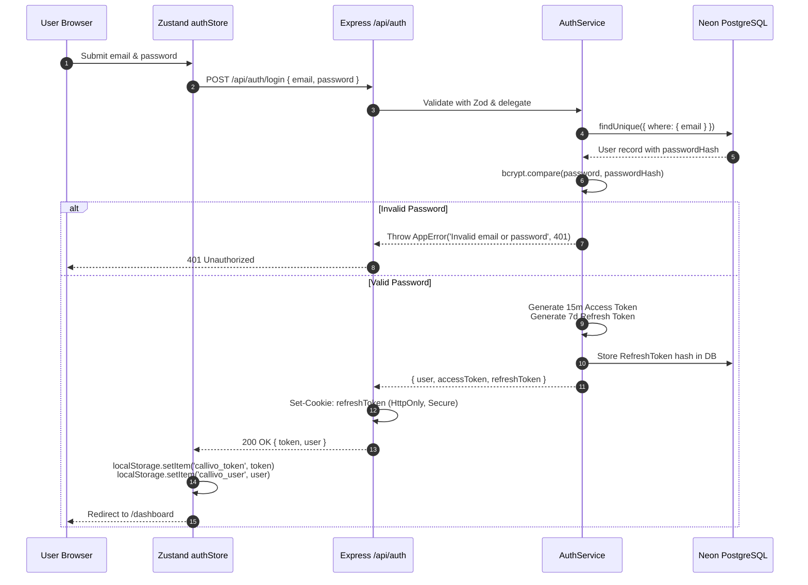

# 07. Authentication & Session Management — CALLIVO

> **CALLIVO — Meet. Connect. Collaborate.**  
> Exhaustive Technical Guide to Security, Cryptography, and Session Architecture

---

## 1. Authentication Architecture Overview

CALLIVO implements a **Dual-Token JSON Web Token (JWT)** authentication architecture with **bcrypt password hashing**, **HTTP-only cookie refresh rotation**, and **client-side state persistence**.



---

## 2. Core Cryptographic Components

### A. Password Hashing (bcryptjs)
- **Algorithm:** Blowfish-based adaptive hashing with automatic salt generation.
- **Cost Factor:** 10 rounds (`bcrypt.hash(password, 10)`), generating a 60-character salted hash string.
- **Security Guarantee:** Protects stored credentials against rainbow-table attacks and GPU-accelerated dictionary attacks.

### B. Dual Token Mechanism
1. **Access Token (Short-Lived):**
   - **Expiration:** 15 minutes (`JWT_EXPIRES_IN="15m"`).
   - **Signing Algorithm:** HMAC SHA-256 (`HS256`).
   - **Payload Claims:**
     ```json
     {
       "sub": "9d48b77a-2451-46bb-88fa-0164e2ec52e4",
       "email": "alex.dev@callivo.com",
       "name": "Alex Mercer",
       "role": "user",
       "iat": 1726224000,
       "exp": 1726224900
     }
     ```
   - **Transmission:** Sent in the standard HTTP header: `Authorization: Bearer <accessToken>`.
2. **Refresh Token (Long-Lived):**
   - **Expiration:** 7 days (`JWT_REFRESH_EXPIRES_IN="7d"`).
   - **Storage:** Stored in a secure `HttpOnly`, `SameSite=Lax` cookie and tracked in the database `RefreshToken` model.
   - **Revocation:** Can be explicitly revoked on logout or during security audits.

---

## 3. Step-by-Step Authentication Workflows

### 1. Registration (`POST /api/auth/register`)
1. User provides `name`, `email`, and `password` on `/signup`.
2. Server validates input using Zod (`RegisterSchema`).
3. Checks if an account with that email already exists in the database (`409 Conflict` if duplicate).
4. Generates a bcrypt hash of the password.
5. In a single atomic Prisma transaction, creates the `User` record and initialized default `UserSettings`.
6. Generates access and refresh tokens, sets the `refreshToken` cookie, and returns the user profile and access token.

### 2. Login (`POST /api/auth/login`)
1. Client submits credentials via `/login`.
2. Server normalizes the email to lowercase and retrieves the `User` record.
3. Compares the submitted plain password against the stored `passwordHash` using `bcrypt.compare`.
4. Updates user status to `online` and sets `lastSeenAt` to current timestamp.
5. Issues fresh tokens and sets the HTTP-only cookie.
6. Frontend updates `authStore`, stores tokens in `localStorage`, and transitions the user to `/dashboard`.

### 3. Token Refresh (`POST /api/auth/refresh`)
1. When an API call returns `401 Unauthorized` due to token expiration, the client triggers a refresh request.
2. The server extracts the refresh token from `req.cookies.refreshToken` (or request body fallback).
3. Verifies the cryptographic signature against `config.jwt.refreshSecret`.
4. Validates that the associated user exists and the token is not revoked.
5. Issues a brand-new access token and rotated refresh token cookie.

### 4. Logout (`POST /api/auth/logout`)
1. Client issues a logout request.
2. Server clears the `refreshToken` cookie (`res.clearCookie('refreshToken')`).
3. If an authenticated user ID is present, updates user status to `offline`.
4. Frontend executes `authStore.logout()`, removing `callivo_token` and `callivo_user` from `localStorage`, disconnecting the Socket.IO instance, and navigating to `/login`.

### 5. Password Reset Flow
1. **Request Reset (`POST /api/auth/forgot-password`):**
   - User enters email on `/forgot-password`.
   - Server generates a cryptographically random UUID token (`uuidv4()`) with a 1-hour expiration.
   - Persists a `PasswordReset` record in the database.
   - Dispatches a reset link via `emailService.sendPasswordResetEmail(email, token)`.
   - Returns a generic success message to prevent user enumeration attacks.
2. **Execute Reset (`POST /api/auth/reset-password`):**
   - User clicks the emailed link leading to `/reset-password?token=<token>`.
   - User submits new password.
   - Server verifies token exists, is unused (`usedAt === null`), and has not expired.
   - Hashes the new password and updates `user.passwordHash` and `resetEntry.usedAt` in a transaction.

---

## 4. Federated Identity Clarification (`/api/auth/google`)

To maintain absolute technical precision:
> [!IMPORTANT]
> The `/api/auth/google` endpoint currently provides **account federation and profile auto-provisioning**, rather than server-side Google OAuth2 token verification via `google-auth-library`.
> 
> **How It Actually Operates:**
> - When triggered, the frontend passes user identity attributes (`{ email, name, avatar }`) to `/api/auth/google`.
> - The backend checks if a user with that email already exists. If not, it provisions a new user with a random generated password hash and links the profile.
> - The server then issues standard CALLIVO JWT access and refresh tokens.
> - Full server-side Google OAuth Client ID token verification is planned for the enterprise security roadmap.

---

## 5. Client-Side Authentication State & Persistence

### `src/stores/authStore.ts`
The client manages user authentication state through a centralized Zustand store:
- **State Properties:**
  - `user: User | null`
  - `token: string | null`
  - `isAuthenticated: boolean`
  - `isLoading: boolean`
- **Actions:**
  - `login(credentials)`: Calls `authApi.login`, updates state, stores tokens.
  - `register(data)`: Calls `authApi.register`, provisions user.
  - `logout()`: Clears local storage and redirects to landing/login.
  - `loadUser()`: Executed on initial application bootstrap; reads `callivo_token` from `localStorage`, queries `/api/users/me`, and validates the active session.
  - `updateUser(data)`: Synchronously mutates local profile state after settings updates.

### Route Protection Strategy
1. **Public Routes:** Accessible to anyone (`/`, `/login`, `/signup`, `/forgot-password`, `/reset-password`, `/meetings/:id/lobby`).
2. **Protected App Routes:** Wrapped inside `<AppLayout />` in `App.tsx`. If `isAuthenticated` evaluates to false after `loadUser()`, the layout redirects the visitor to `/login`.
3. **Hybrid Meeting Rooms (`/room/:id`):** Permits authenticated users (who join with their registered identity and host permissions) while allowing unauthenticated guest attendees with display names.
