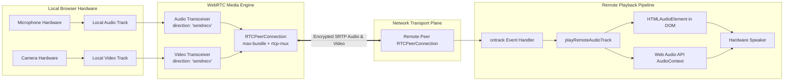
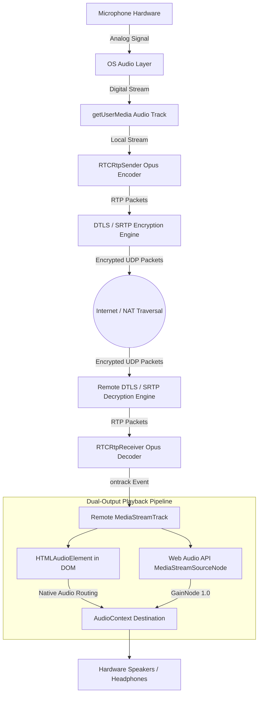
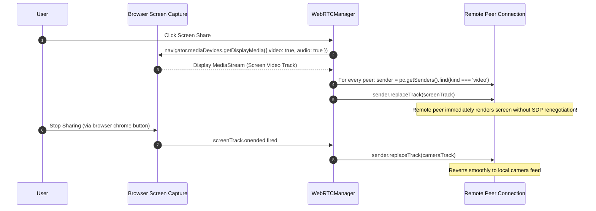

# 08. WebRTC Deep Dive & Media Transport — CALLIVO

> **CALLIVO — Meet. Connect. Collaborate.**  
> Exhaustive Engineering Reference to the Client WebRTC Media Engine

---

## 1. WebRTC Architectural Foundation

CALLIVO's real-time media engine is encapsulated within `WebRTCManager` (`src/lib/webrtc.ts`), a singleton class coordinating hardware access, peer connections, SDP negotiation, and hardware audio playback.



---

## 2. Core WebRTC Primitives Explained

### A. `getUserMedia()` & Media Streams
1. **`navigator.mediaDevices.getUserMedia(constraints)`:**
   - Queries user permission and opens audio/video capture hardware.
   - CALLIVO constraints enforce high-fidelity echo cancellation, noise suppression, and automatic gain control:
     ```typescript
     audio: {
       echoCancellation: true,
       noiseSuppression: true,
       autoGainControl: true,
     },
     video: {
       width: { ideal: 1280 },
       height: { ideal: 720 },
       frameRate: { ideal: 30 },
     }
     ```
2. **`MediaStream`:** A synchronized container holding one or more media tracks (e.g., one audio track and one video track).
3. **`MediaStreamTrack`:** An individual media pipeline (`kind: 'audio'` or `kind: 'video'`).
   - `track.enabled = false` silences or blanks the track without breaking the peer connection or requiring renegotiation.

### B. `RTCPeerConnection` Configuration
CALLIVO configures every `RTCPeerConnection` with strict production policies:
```typescript
new RTCPeerConnection({
  iceServers: this.iceServers,
  iceCandidatePoolSize: 2,
  bundlePolicy: 'max-bundle',
  rtcpMuxPolicy: 'require',
});
```
- **`bundlePolicy: 'max-bundle'`:** Demands that all media streams (audio, video, and data channels) share a single transport connection (single IP/port pair), dramatically accelerating connection setup and conserving socket handles.
- **`rtcpMuxPolicy: 'require'`:** Multiplexes RTCP control packets onto the same UDP port as RTP media packets, eliminating the need for a secondary port.

### C. Transceivers, Senders, and Receivers
- **`RTCRtpSender`:** Responsible for encoding and transmitting a track across the connection. Exposes `sender.replaceTrack(newTrack)` to swap video tracks (e.g., camera $\longleftrightarrow$ screen share) without SDP renegotiation.
- **`RTCRtpReceiver`:** Responsible for receiving and decoding incoming RTP packets into a live `MediaStreamTrack`.
- **`RTCRtpTransceiver`:** The unified bidirectional pair linking one sender and one receiver.
  - Direction controls media flow: `'sendrecv'`, `'sendonly'`, `'recvonly'`, or `'inactive'`.

---

## 3. End-to-End Media Flows

### The CALLIVO Audio Pipeline (Microphone to Speaker)



### The CALLIVO Video Pipeline (Camera to Screen)
1. **Camera Hardware Capture:** Digital sensor captures 720p 30fps raw frames.
2. **Local Track Attachment:** Video track attached to video transceiver with `direction = 'sendrecv'`.
3. **Hardware Encoding:** Browser encodes video using hardware-accelerated VP8 or H.264 codecs.
4. **Packetization & SRTP:** Frames are chunked into RTP packets, encrypted with SRTP keys derived from the DTLS handshake, and transmitted over UDP.
5. **Remote Arrival & Decoding:** Remote peer receives packets, decodes frames via GPU, and triggers the `pc.ontrack` handler.
6. **DOM Rendering:** A fresh `MediaStream` containing the remote video track is attached to the participant tile's `<video>` tag (`videoRef.current.srcObject = stream`), playing inline at 60fps.

---

## 4. Screen Sharing & Dynamic Track Replacement

CALLIVO provides seamless screen sharing using the Screen Capture API without dropping or renegotiating peer connections:



---

## 5. Historical Debugging Lessons: Major WebRTC Bugs Discovered and Resolved

During the development and testing of CALLIVO across multi-device networks, several subtle WebRTC bugs were encountered, diagnosed, and permanently resolved. Documenting these lessons provides valuable engineering depth:

### Bug 1: The Asymmetric Transceiver Conflict (One-Way Audio Stall)
- **Problem Symptom:** User A could hear User B, but User B could never hear User A, despite both microphone indicators glowing green.
- **Root Cause Analysis:**
  - Offerer (User A) called `pc.addTransceiver(track, { direction: 'sendrecv' })` and created an offer with an audio media line `m=audio` set to `a=sendrecv`.
  - Answerer (User B) received the offer, but also called `pc.addTransceiver(localTrack, { direction: 'sendrecv' })` *before* handling the offer.
  - In the WebRTC specification, `addTransceiver` appends a **brand new media section** to the SDP. This caused the answerer's SDP to have two audio lines: one `recvonly` corresponding to the offer, and a second `sendonly` line that the offerer was not expecting.
  - Result: Audio packets flowed in only one direction.
- **The CALLIVO Fix:**
  - In `handleOffer`, the answerer does **NOT** call `addTransceiver`. Instead, it inspects existing transceivers created automatically by `setRemoteDescription(offer)`.
  - Locates the remote audio transceiver, attaches the local microphone track to its sender using `replaceTrack()`, and sets `transceiver.direction = 'sendrecv'`.
  - Result: Bidirectional symmetric media flow negotiated over a single unified `m=audio` section.

### Bug 2: Browser Autoplay Restriction Policy
- **Problem Symptom:** Inbound audio packets were verified arriving (visible in WebRTC stats as growing `bytesReceived`), but no sound came out of the physical speakers.
- **Root Cause Analysis:**
  - Modern Chromium and Safari security policies forbid web pages from playing unmuted audio automatically unless the user has interacted with the document via a click or tap (Autoplay Policy).
  - When an incoming call connects without an explicit button click on the room page, `audio.play()` rejects with `NotAllowedError: play() failed because the user didn't interact with the document first`.
- **The CALLIVO Fix:**
  - Implemented a proactive **Autoplay Watchdog** in `WebRTCManager`:
    1. Traps `audioEl.play().catch(err => ...)` and flags `isAudioAutoplayBlocked = true`.
    2. Broadcasts state to the UI via `onAudioAutoplayBlockedChange`, displaying a glowing **"Click to Enable Audio"** banner.
    3. Attaches global passive event listeners on `click`, `touchstart`, and `keydown`.
    4. Upon first interaction, simultaneously calls `audioEl.play()` on all pending audio elements and resumes the `AudioContext` (`audioContext.resume()`).

### Bug 3: Dual-Output Audio Pipeline (DOM vs. Web Audio API)
- **Problem Symptom:** In some mobile browsers, backgrounded tabs muted DOM `<audio>` tags to conserve power.
- **The CALLIVO Fix:**
  - Implemented a **Dual-Output Architecture**: Every remote audio track is routed simultaneously through:
    1. A persistent, hidden DOM `<audio>` element mounted in `#callivo-audio-container`.
    2. A Web Audio API `AudioContext` graph connecting a `MediaStreamAudioSourceNode` through a `GainNode` directly to `audioContext.destination` (hardware audio sink).
  - This redundancy guarantees uninterrupted playback even if the browser deprioritizes background DOM elements.

### Bug 4: ICE Candidate Early Arrival Race Condition
- **Problem Symptom:** ICE candidates received from the signaling server threw errors: `Failed to execute 'addIceCandidate' on 'RTCPeerConnection': remote description is null`.
- **Root Cause:** Fast network conditions can cause ICE candidates to arrive over WebSockets before the browser has finished executing the asynchronous `setRemoteDescription(offer)`.
- **The CALLIVO Fix:**
  - Implemented an in-memory candidate queue (`pendingCandidates: Map<string, RTCIceCandidateInit[]>`).
  - If `pc.remoteDescription` is null when a candidate arrives, it is queued.
  - Once `setRemoteDescription` resolves, `drainPendingCandidates()` flushes the queue into the peer connection.
