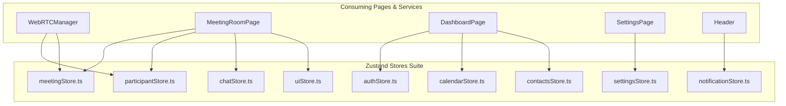

# 11. State Management & Zustand Stores — CALLIVO

> **CALLIVO — Meet. Connect. Collaborate.**  
> Comprehensive Guide to Client-Side Reactive State Architecture

---

## 1. Why Zustand Was Chosen for CALLIVO

Managing state in a real-time WebRTC conferencing application poses unique challenges:
1. **Asynchronous Lifecycle Outside React:** WebRTC events (`ontrack`, `onicecandidate`, `onconnectionstatechange`) and Socket.IO event listeners fire unpredictably outside the React component render loop. Zustand stores can be read and mutated imperatively from any TypeScript file (`store.getState().setField(...)`) without triggering context provider hell.
2. **High-Frequency Telemetry:** Audio meters and speaking detectors fire up to 10–20 times per second. Zustand's atomic selector model (`useMeetingStore(state => state.isSpeaking)`) ensures only the specific UI element (e.g., the glowing participant border) re-renders, while the rest of the 50-component meeting room remains untouched.
3. **Zero Boilerplate:** Unlike Redux, Zustand requires no reducers, action type constants, dispatchers, or complex middleware chains.

---

## 2. Comprehensive Store Catalog (All 9 Stores)

---

### Store 1: `authStore.ts` (`src/stores/authStore.ts`)
- **Purpose:** Manages user authentication status, active profile credentials, and session tokens.
- **State:**
  - `user: User | null`
  - `token: string | null`
  - `isAuthenticated: boolean`
  - `isLoading: boolean`
- **Actions:**
  - `login(credentials)`: Authenticates with backend and saves token to `localStorage`.
  - `register(data)`: Creates new account and logs in.
  - `logout()`: Clears `localStorage` credentials and resets state.
  - `loadUser()`: Reads persisted token and fetches `/api/users/me` on app boot.
  - `updateUser(partial)`: Updates local user properties.
- **Used By:** `AppLayout`, `AuthLayout`, `LoginPage`, `SignupPage`, `ProfilePage`, `DashboardPage`.

---

### Store 2: `meetingStore.ts` (`src/stores/meetingStore.ts`)
- **Purpose:** Manages active in-call hardware states, room settings, and meeting metadata.
- **State:**
  - `currentMeeting: Meeting | null`
  - `isAudioMuted: boolean`
  - `isVideoOff: boolean`
  - `isScreenSharing: boolean`
  - `isHandRaised: boolean`
  - `isRecording: boolean`
  - `activeSpeakerId: string | null`
  - `pinnedParticipantId: string | null`
  - `spotlightParticipantId: string | null`
  - `connectionQuality: 'excellent' | 'good' | 'poor'`
  - `isLobbyOpen: boolean`
- **Actions:**
  - `setCurrentMeeting(meeting)`
  - `toggleAudio()`, `toggleVideo()`, `toggleScreenShare()`, `toggleHand()`
  - `setRecording(boolean)`
  - `setActiveSpeaker(socketId)`
  - `setPinnedParticipant(socketId)`
  - `setSpotlightParticipant(socketId)`
  - `leaveMeeting()`
- **Used By:** `MeetingRoomPage`, `MeetingControls`, `ParticipantGrid`, `ParticipantTile`.

---

### Store 3: `participantStore.ts` (`src/stores/participantStore.ts`)
- **Purpose:** Manages the live roster of in-meeting participants and waiting room attendees.
- **State:**
  - `participants: Map<string, ParticipantState>` (Keyed by Socket ID)
  - `waitingParticipants: WaitingParticipant[]`
- **Actions:**
  - `setParticipants(participantsArray)`: Sets initial roster received from `meeting:state`.
  - `addParticipant(participant)`: Appends newly joined attendee.
  - `updateParticipant(socketId, updates)`: Updates audio/video/hand status of a peer.
  - `removeParticipant(socketId)`: Evicts departed attendee.
  - `setWaitingParticipants(list)`: Updates host waiting room list.
  - `removeWaitingParticipant(socketId)`: Evicts admitted/rejected waiting user.
- **Used By:** `MeetingRoomPage`, `ParticipantsDrawer`, `ParticipantGrid`, `webrtc.ts`.

---

### Store 4: `chatStore.ts` (`src/stores/chatStore.ts`)
- **Purpose:** Stores live in-meeting public and private chat messages and unread counters.
- **State:**
  - `messages: ChatMessage[]`
  - `unreadCount: number`
  - `activeTab: 'public' | 'private'`
- **Actions:**
  - `addMessage(message)`: Appends incoming message and increments unread count if drawer is closed.
  - `clearUnread()`: Resets unread badge counter to zero.
  - `clearChat()`: Resets chat log upon leaving meeting.
- **Used By:** `ChatDrawer`, `MeetingControls`, `MeetingRoomPage`.

---

### Store 5: `calendarStore.ts` (`src/stores/calendarStore.ts`)
- **Purpose:** Manages scheduled meeting events, month filtering, and calendar mutations.
- **State:**
  - `events: CalendarEvent[]`
  - `selectedDate: Date`
  - `isLoading: boolean`
- **Actions:**
  - `fetchEvents(month)`: Queries `/api/calendar`.
  - `addEvent(event)`: Dispatches create request.
  - `deleteEvent(id)`: Removes event.
  - `setSelectedDate(date)`: Updates active calendar view day.
- **Used By:** `CalendarPage`, `DashboardPage`.

---

### Store 6: `contactsStore.ts` (`src/stores/contactsStore.ts`)
- **Purpose:** Manages address book entries, favorites, and search queries.
- **State:**
  - `contacts: Contact[]`
  - `searchQuery: string`
  - `isLoading: boolean`
- **Actions:**
  - `fetchContacts()`: Queries `/api/contacts`.
  - `addContact(email)`: Submits email invitation to contacts.
  - `toggleFavorite(id)`: Stars/unstars contact.
  - `removeContact(id)`: Removes contact.
- **Used By:** `ContactsPage`, `DashboardPage`.

---

### Store 7: `notificationStore.ts` (`src/stores/notificationStore.ts`)
- **Purpose:** Tracks in-app alerts and header notification badges.
- **State:**
  - `notifications: Notification[]`
  - `unreadCount: number`
- **Actions:**
  - `fetchNotifications()`: Queries `/api/notifications`.
  - `markAsRead(id)`: Marks specific notification read.
  - `markAllAsRead()`: Clears all unread badges.
- **Used By:** `AppLayout` (Header Bell), `DashboardPage`.

---

### Store 8: `settingsStore.ts` (`src/stores/settingsStore.ts`)
- **Purpose:** Manages persistent user preferences, audio noise suppression flags, and theme modes.
- **State:**
  - `settings: UserSettings`
  - `selectedAudioInputId: string`
  - `selectedAudioOutputId: string`
  - `selectedVideoInputId: string`
- **Actions:**
  - `loadSettings()`: Queries `/api/settings`.
  - `updateSettings(partial)`: Dispatches PATCH request to `/api/settings`.
  - `setDevice(type, deviceId)`: Updates selected hardware device ID.
- **Used By:** `SettingsPage`, `DeviceSettingsModal`, `MeetingLobbyPage`.

---

### Store 9: `uiStore.ts` (`src/stores/uiStore.ts`)
- **Purpose:** Controls transient UI overlay visibility across the application.
- **State:**
  - `isChatDrawerOpen: boolean`
  - `isParticipantsDrawerOpen: boolean`
  - `isQnADrawerOpen: boolean`
  - `isCommentsDrawerOpen: boolean`
  - `isSettingsModalOpen: boolean`
  - `isDiagnosticsModalOpen: boolean`
- **Actions:**
  - `toggleChatDrawer()`, `toggleParticipantsDrawer()`, `toggleQnADrawer()`, etc.
  - `closeAllDrawers()`: Closes any open sliding panels.
- **Used By:** `MeetingRoomPage`, `MeetingControls`.
