# 12. Client-Side Routing & Navigation — CALLIVO

> **CALLIVO — Meet. Connect. Collaborate.**  
> Comprehensive Reference to React Router v6 Architecture & Navigation Shells

---

## 1. Routing Architecture Overview

CALLIVO utilizes **React Router 6.28** for client-side single-page application (SPA) routing. All routes are declared inside [App.tsx](file:///c:/Users/hardi/OneDrive/Desktop/CALLIVO/src/App.tsx) and wrapped in a global `ToastProvider` for notification alerts.

```mermaid
graph TD
    Root[BrowserRouter] --> HeadHandler[RouteHeadHandler Title/Branding]
    Root --> RoutesContainer[Routes Switch]

    RoutesContainer --> Landing["/ (LandingPage)"]
    
    RoutesContainer --> AuthGroup["AuthLayout Group"]
    AuthGroup --> Login["/login (LoginPage)"]
    AuthGroup --> Signup["/signup (SignupPage)"]
    AuthGroup --> Forgot["/forgot-password (ForgotPasswordPage)"]
    AuthGroup --> Reset["/reset-password (ResetPasswordPage)"]
    AuthGroup --> Verify["/verify (VerifyPage)"]

    RoutesContainer --> Onboarding["/onboarding (OnboardingPage)"]

    RoutesContainer --> StandaloneRooms["Fullscreen Meeting Group"]
    StandaloneRooms --> Lobby1["/meetings/:id/lobby"]
    StandaloneRooms --> Lobby2["/lobby/:id"]
    StandaloneRooms --> Room1["/meetings/:id/room"]
    StandaloneRooms --> Room2["/room/:id"]

    RoutesContainer --> AppShellGroup["AppLayout Group (Protected)"]
    AppShellGroup --> Dashboard["/dashboard (DashboardPage)"]
    AppShellGroup --> Meetings["/meetings (MeetingsPage)"]
    AppShellGroup --> Schedule["/schedule (ScheduleMeetingPage)"]
    AppShellGroup --> Calendar["/calendar (CalendarPage)"]
    AppShellGroup --> Contacts["/contacts (ContactsPage)"]
    AppShellGroup --> Messages["/messages (MessagesPage)"]
    AppShellGroup --> Recordings["/recordings (RecordingsPage)"]
    AppShellGroup --> Profile["/profile (ProfilePage)"]
    AppShellGroup --> Settings["/settings/* (SettingsPage Sub-routes)"]
    AppShellGroup --> Help["/help (HelpPage)"]

    RoutesContainer --> CatchAll["* (Fallback Redirect to /)"]
```



---

## 2. Route Branding & Head Management (`RouteHeadHandler`)

To guarantee that title tags and canonical favicons remain intact during client-side route transitions without flashing browser defaults, `App.tsx` embeds a dedicated `RouteHeadHandler` hook:
```typescript
const RouteHeadHandler: React.FC = () => {
  const location = useLocation();

  React.useEffect(() => {
    document.title = 'CALLIVO — Meet. Connect. Collaborate.';

    let iconLink = document.querySelector<HTMLLinkElement>("link[rel~='icon'][type='image/svg+xml']");
    if (!iconLink) {
      iconLink = document.createElement('link');
      iconLink.rel = 'icon';
      iconLink.type = 'image/svg+xml';
      iconLink.href = '/favicon.svg';
      document.head.appendChild(iconLink);
    } else if (iconLink.getAttribute('href') !== '/favicon.svg') {
      iconLink.setAttribute('href', '/favicon.svg');
    }
  }, [location]);

  return null;
};
```

---

## 3. Authoritative Route Catalog

### Category 1: Public Marketing & Onboarding

| Path | Page Component | Protected? | Purpose & Important Behavior |
| :--- | :--- | :--- | :--- |
| `/` | `LandingPage` | Public | Marketing landing page featuring 3D Three.js interactive hub, feature highlights, live testimonials, and instant "Start Meeting" launcher. |
| `/onboarding` | `OnboardingPage` | Public | Multi-step setup wizard guiding new users through profile details, camera/microphone permission checks, and theme preferences. |

---

### Category 2: Authentication Shell (`AuthLayout`)
These routes are nested within `<AuthLayout />`, which renders a split-screen brand showcase on desktop and a clean centered glassmorphic card on mobile:

| Path | Page Component | Protected? | Purpose & Important Behavior |
| :--- | :--- | :--- | :--- |
| `/login` | `LoginPage` | Public | Credential login form with password visibility toggle, remember-me checkbox, and federated Google sign-in. |
| `/signup` | `SignupPage` | Public | User registration form with live password strength indicator and terms agreement check. |
| `/forgot-password` | `ForgotPasswordPage`| Public | Email submission form dispatching password recovery instructions. |
| `/reset-password` | `ResetPasswordPage` | Public | Accepts query parameter `?token=...`, validates reset token, and allows entering a new password. |
| `/verify` | `VerifyPage` | Public | Confirms email verification tokens. |

---

### Category 3: Fullscreen Standalone Meeting Rooms
These routes deliberately bypass standard navigation bars and sidebars to maximize screen real estate for video feeds:

| Path | Page Component | Protected? | Purpose & Important Behavior |
| :--- | :--- | :--- | :--- |
| `/meetings/:id/lobby` | `MeetingLobbyPage` | Hybrid | Device testing room. Previews local camera/mic, verifies passcode, tests audio output, and enters the call. |
| `/lobby/:id` | `MeetingLobbyPage` | Hybrid | Shortened alias for the meeting lobby. |
| `/meetings/:id/room` | `MeetingRoomPage` | Hybrid | Core active video conference. Manages WebRTC peer connections, video grid, chat drawers, and host moderation. |
| `/room/:id` | `MeetingRoomPage` | Hybrid | Canonical shortened invitation URL (e.g., `https://callivo.vercel.app/room/clv-849-2180`). |

---

### Category 4: Authenticated Application Shell (`AppLayout`)
Protected routes requiring an authenticated user session. Wrapped inside `<AppLayout />`, which provides the persistent left sidebar navigation, top search/notification bar, and user profile menu:

| Path | Page Component | Protected? | Purpose & Important Behavior |
| :--- | :--- | :--- | :--- |
| `/dashboard` | `DashboardPage` | Protected | Personal dashboard showing quick meeting launch buttons, upcoming schedule, active contacts, and usage metrics. |
| `/meetings` | `MeetingsPage` | Protected | Historical meeting logs, past attendance records, and upcoming scheduled sessions with edit/delete controls. |
| `/schedule` | `ScheduleMeetingPage` | Protected | Comprehensive scheduling form with passcode setup, waiting room toggles, participant email invites, and timezone selection. |
| `/calendar` | `CalendarPage` | Protected | Interactive monthly/weekly calendar view with direct meeting links and appointment creation. |
| `/contacts` | `ContactsPage` | Protected | Address book for managing contacts, searching registered users, and initiating direct 1-on-1 video calls. |
| `/messages` | `MessagesPage` | Protected | Asynchronous 1-on-1 direct messaging threads with online status indicators. |
| `/recordings` | `RecordingsPage` | Protected | Archive of recorded video meetings with inline HTML5 video playback, download links, and duration/size metadata. |
| `/profile` | `ProfilePage` | Protected | Profile management allowing users to update display name, bio, phone, and upload/crop custom avatar images. |
| `/settings` | `SettingsPage` | Protected | User preferences dashboard with tabbed sub-views. |
| `/settings/account` | `SettingsPage` | Protected | Account security sub-tab (change password, active sessions). |
| `/settings/security`| `SettingsPage` | Protected | Privacy controls and audit log review. |
| `/settings/meeting` | `SettingsPage` | Protected | Default meeting preferences (auto-mute on entry, default waiting room). |
| `/settings/audio` | `SettingsPage` | Protected | Audio input selection, echo cancellation, and noise suppression toggles. |
| `/settings/video` | `SettingsPage` | Protected | Video input selection, resolution cap (720p/1080p), and framerate cap. |
| `/settings/notifications`| `SettingsPage` | Protected | Email and in-app alert preference checkboxes. |
| `/settings/appearance` | `SettingsPage` | Protected | Theme selector (`dark` | `light` | `system`). |
| `/help` | `HelpPage` | Protected | Helpdesk support center with FAQ accordion, live chat simulation, and ticket submission form. |

---

### Category 5: Fallback Route
- **Path:** `*`
- **Behavior:** `<Navigate to="/" replace />`
- **Purpose:** Gracefully redirects any undefined URL back to the landing page.
