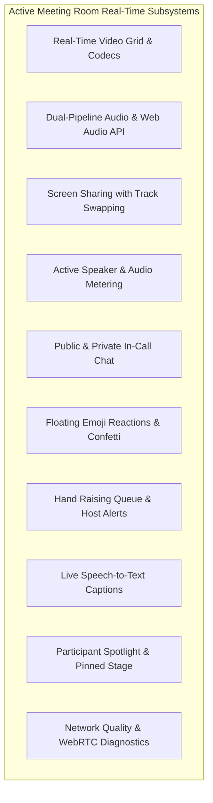

# 13. Real-Time Collaboration & Interactive Features — CALLIVO

> **CALLIVO — Meet. Connect. Collaborate.**  
> Exhaustive Guide to Real-Time In-Meeting Features & Mechanics

---

## 1. Real-Time Capabilities Matrix

All features documented below are fully implemented and verified in the active codebase:

---

## 2. In-Depth Feature Analysis

### 1. Ultra-Low Latency Audio & Video Conferencing
- **Implementation:** WebRTC P2P Mesh (`RTCPeerConnection`).
- **Codecs:** Opus audio at 48kHz stereo, VP8 and H.264 video hardware-accelerated encoding.
- **Dynamic Grid Management:** `ParticipantGrid.tsx` automatically balances video tiles across available screen geometry, providing 60fps hardware-rendered video playback.

### 2. Dual-Pipeline Audio & Autoplay Policy Recovery
- **Implementation:** Combines background HTML5 `<audio>` DOM nodes with a parallel Web Audio API pipeline (`MediaStreamAudioSourceNode` $\rightarrow$ `GainNode` $\rightarrow$ `AudioContext.destination`).
- **Autoplay Recovery:** If a browser blocks unmuted audio on call entry, `WebRTCManager` captures the rejection, exposes an interactive banner, and binds window-level click/tap handlers to seamlessly unblock and play all peer streams simultaneously upon the user's first gesture.

### 3. Active Speaker Detection & Visual Highlighting
- **Implementation:** `WebRTCManager.setupAudioAnalyser()` creates an `AnalyserNode` connected to the local microphone stream with an FFT size of 512.
- **Algorithm:**
  - Evaluates average frequency amplitude every 200ms across the frequency spectrum.
  - If average amplitude exceeds threshold (>25), the client flags speech and emits `media:active-speaker { isSpeaking: true }`.
  - The signaling gateway broadcasts this to the room, causing the speaking participant's tile to illuminate with an animated emerald border.

### 4. High-Definition Screen Sharing
- **Implementation:** `navigator.mediaDevices.getDisplayMedia({ video: true, audio: true })`.
- **Dynamic Track Swapping:** Rather than renegotiating SDP or re-dialing peers, CALLIVO accesses the active video transceiver's sender (`pc.getSenders().find(kind === 'video')`) and invokes `sender.replaceTrack(screenTrack)`.
- **Seamless Reversion:** Listens to `screenTrack.onended` (fired when the user stops sharing via browser chrome controls), immediately swapping back to the camera track without interruption.

### 5. In-Call Chat (Public Broadcast & Private Whispering)
- **Implementation:** Socket.IO event `chat:message` routed through the signaling gateway.
- **Capabilities:**
  - Public broadcast: Delivers message to all participants in `room:${meetingId}`.
  - Private whisper: Specifying `toSocketId` routes the message strictly to the targeted peer and sender socket, keeping side conversations completely confidential.
  - Unread Badge Tracking: Displays an unread badge on the chat toolbar button whenever new messages arrive while the chat drawer is closed.

### 6. Floating Emoji Reactions & Particle Confetti
- **Implementation:** `reaction:send` and `canvas-confetti`.
- **Visuals:**
  - When an attendee clicks an emoji (❤️, 👍, 👏, 🎉, 🔥, 🚀), the reaction is broadcast via Socket.IO.
  - Renders a floating physics animation traveling upward from the participant's video tile.
  - Celebration triggers emit high-performance confetti particle bursts across the meeting screen.

### 7. Hand Raising & Queue Management
- **Implementation:** `hand:toggle` Socket.IO event updating `participant.isHandRaised`.
- **Host Queue:** Displays a prominent notification badge for the host showing who raised their hand and when. The host can acknowledge individual hands or click "Lower All Hands".

### 8. Live Speech-to-Text Captions
- **Implementation:** Web Speech Recognition API (`webkitSpeechRecognition`) in `CaptionsOverlay.tsx`.
- **Mechanics:**
  - Captures local spoken audio, generates continuous text transcripts, and emits `captions:transcript` events.
  - The signaling server broadcasts these as `captions:broadcast`, rendering synchronized, high-contrast subtitle overlays on all attendees' screens with speaker attribution.

### 9. Speaker Spotlighting & Pinned Stage Mode
- **Implementation:** `host:spotlight` Socket.IO event.
- **Stage Layout:** When a participant is spotlighted or screen sharing, `ParticipantGrid.tsx` transitions from a uniform grid into a large focus stage with a thumbnail carousel below.

### 10. Real-Time Network Quality & Diagnostics Modal
- **Implementation:** WebRTC `pc.getStats()` inspected every 1.5 seconds.
- **Metrics Displayed:** Live RTT (ms), packet loss percentage, audio bitrate (Kbps), audio jitter (ms), negotiation direction (`sendrecv`), and selected ICE candidate IP/protocol pairs.
