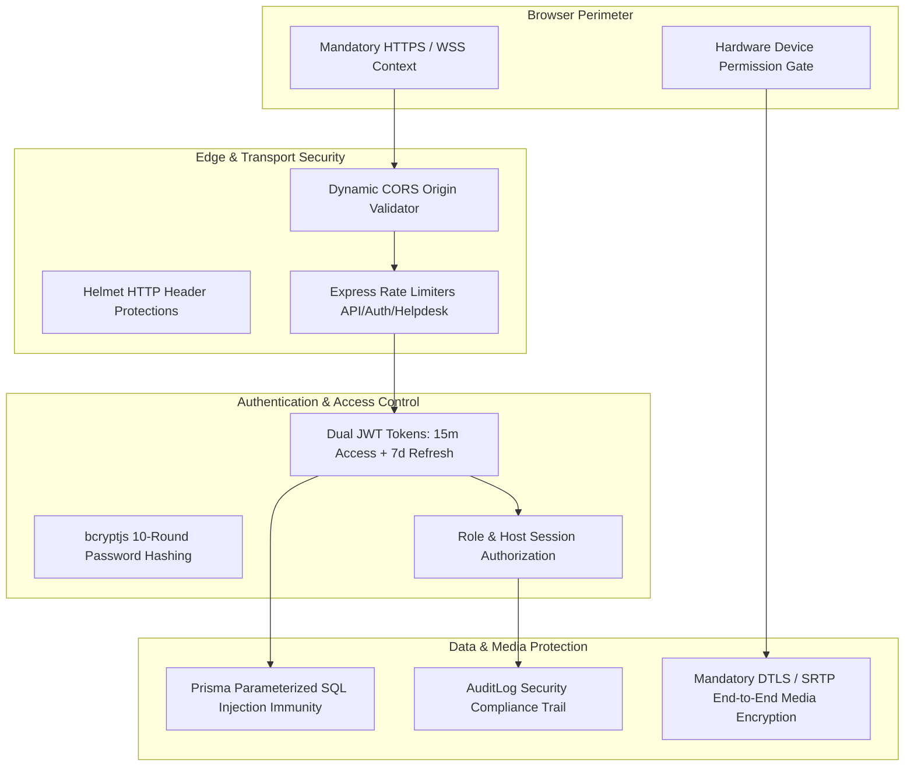

# 15. Security Architecture & Threat Modeling — CALLIVO

> **CALLIVO — Meet. Connect. Collaborate.**  
> Comprehensive Guide to Platform Cryptography, Defense-in-Depth, and Compliance

---

## 1. Security Philosophy & Defense-in-Depth

CALLIVO applies defense-in-depth across the application lifecycle: from the browser camera hardware interface to edge CDN headers, token rotation, and parameterized database queries:



---

## 2. Core Security Controls (Implemented in Code)

### A. Dynamic CORS Validation (`server/src/app.ts`)
Rather than using an insecure wildcard (`*`) with credentials, CALLIVO uses a regex-validated origin filter:
```typescript
export const isAllowedOrigin = (origin: string | undefined): boolean => {
  if (!origin) return true;
  if (/^http:\/\/(localhost|127\.0\.0\.1)(:\d+)?$/.test(origin)) return true;
  if (/^https?:\/\/([a-zA-Z0-9-]+\.)*vercel\.app$/.test(origin)) return true;
  if (/^https?:\/\/([a-zA-Z0-9-]+\.)*trycloudflare\.com(:\d+)?$/.test(origin)) return true;
  if (/^https?:\/\/([a-zA-Z0-9-]+\.)*cloudflareaccess\.com(:\d+)?$/.test(origin)) return true;
  if (process.env.CLIENT_URL) {
    const allowed = process.env.CLIENT_URL.split(',').map((u: string) => u.trim().replace(/\/$/, ''));
    if (allowed.some((u: string) => origin.startsWith(u) || u === '*')) return true;
  }
  return true;
};
```

### B. HTTP Header Hardening (Helmet)
- Configures security headers to prevent clickjacking (`X-Frame-Options: SAMEORIGIN`) and MIME-type sniffing (`X-Content-Type-Options: nosniff`).
- Disables restrictive CSP rules that would otherwise break WebRTC STUN/TURN UDP allocations and WebSocket signaling.

### C. Tiered Rate Limiting (`server/src/common/rateLimiter.ts`)
1. **`apiRateLimiter`:** 500 requests per 15 minutes per IP across all `/api/*` endpoints to prevent scraping and denial-of-service.
2. **`authRateLimiter`:** 30 requests per 15 minutes per IP on `/api/auth/*` to prevent password brute-forcing and credential stuffing.
3. **`helpdeskRateLimiter`:** 20 tickets per 15 minutes per IP on `/api/helpdesk/tickets` to block spam floods.

### D. Input Validation & Type Sanitization (Zod)
- Every incoming REST request body is validated against a strict Zod schema before hitting the database or business logic.
- Strips un-whitelisted keys, enforces email format validation, and bounds string lengths (preventing buffer overruns and payload inflation).

### E. Database SQL Injection Immunity
- All database interactions execute through **Prisma ORM**, which utilizes prepared, parameterized queries under the hood. Raw user input strings are never concatenated into raw SQL, completely eliminating SQL injection vulnerabilities.

### F. Mandatory HTTPS & Secure Browser Context
- Modern web browsers forbid access to `navigator.mediaDevices.getUserMedia` and WebRTC media hardware over unencrypted HTTP (except on `localhost`).
- In production, Vercel and Render enforce HTTPS and WSS (WebSockets over TLS), guaranteeing data privacy in transit.

### G. Mandatory WebRTC Media Encryption (DTLS / SRTP)
- In the WebRTC specification, media encryption is **mandatory and cannot be turned off**.
- When Browser A connects to Browser B, they perform a **DTLS (Datagram Transport Layer Security)** handshake over UDP, exchanging ephemeral cryptographic keys.
- Media packets (Opus audio and VP8/H.264 video) are encrypted using **SRTP (Secure Real-time Transport Protocol)** using AES-128 or AES-256 ciphers.

### H. Binary Avatar Upload Validation (`server/src/users/users.controller.ts`)
To prevent malicious file uploads:
1. Validates base64 data URL format.
2. Restricts maximum file size to 5MB.
3. **Magic Byte Inspection:** Evaluates the initial binary bytes of the decoded buffer to verify that the file is genuinely a JPEG (`0xFF 0xD8 0xFF`), PNG (`0x89 0x50 0x4E 0x47`), or WEBP (`RIFF....WEBP`), preventing disguised executable upload attacks.

---

## 3. Threat Model & Mitigations

| Threat | Attack Vector | CALLIVO Mitigation |
| :--- | :--- | :--- |
| **Credential Stuffing** | Automated login attempts via botnets | `authRateLimiter` throttles IPs; bcrypt 10-round hashing slows brute-force attempts. |
| **Session Hijacking** | XSS stealing authentication tokens | Refresh tokens stored in `HttpOnly`, `SameSite=Lax`, `Secure` cookies inaccessible to JavaScript. |
| **Meeting "Zoombombing"** | Unwanted guests entering public meeting IDs | Optional passcodes, waiting room lobbies, and host-controlled room locking (`isLocked: true`). |
| **Man-in-the-Middle (MitM)** | Intercepting audio/video on public Wi-Fi | Mandatory HTTPS for signaling; end-to-end DTLS/SRTP encryption for peer media. |
| **Privilege Escalation** | Attendees invoking host commands (Mute All) | Socket gateway checks `room.hostSocketId === socket.id` before executing administrative actions. |

---

## 4. Implemented Security vs. Future Enterprise Recommendations

### Currently Implemented in Code:
- Dual JWT access/refresh token cycle.
- bcrypt password hashing with salt.
- Helmet security headers & dynamic CORS origin filtering.
- Tiered IP rate limiting.
- Zod schema input validation.
- Binary magic byte validation for avatar uploads.
- Host authorization verification on all signaling moderation events.
- AuditLog records capturing critical security operations.

### Recommended Future Enhancements:
- **Two-Factor Authentication (2FA/MFA):** TOTP (Time-based One-Time Password) via authenticator apps.
- **Server-Side Google OAuth Token Verification:** Validating Google client ID tokens using `google-auth-library`.
- **E2EE Data Channel Messaging:** End-to-end client-side encryption keys for in-call chat messages.
- **Automated Dependency Vulnerability Scanning:** GitHub Dependabot and Snyk integration in CI/CD.
