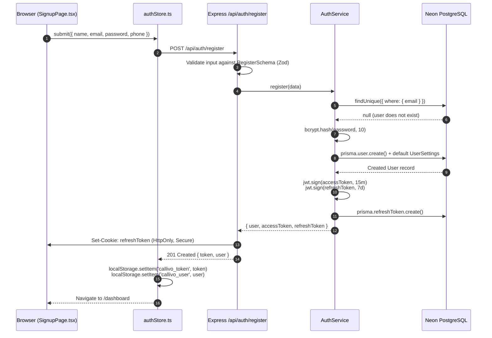
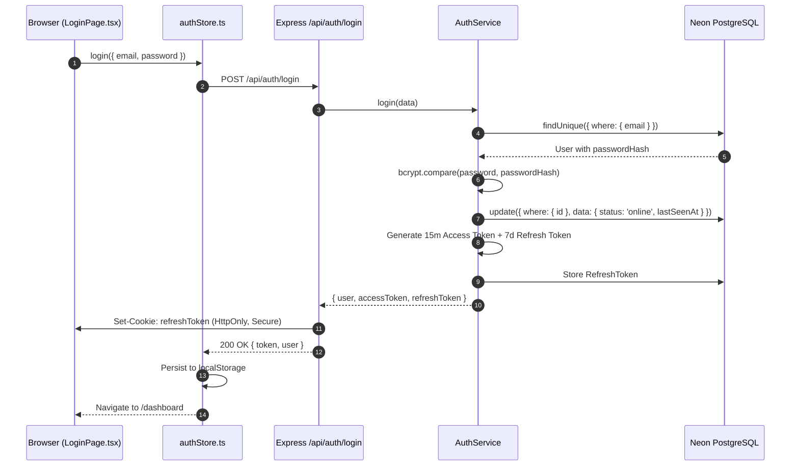
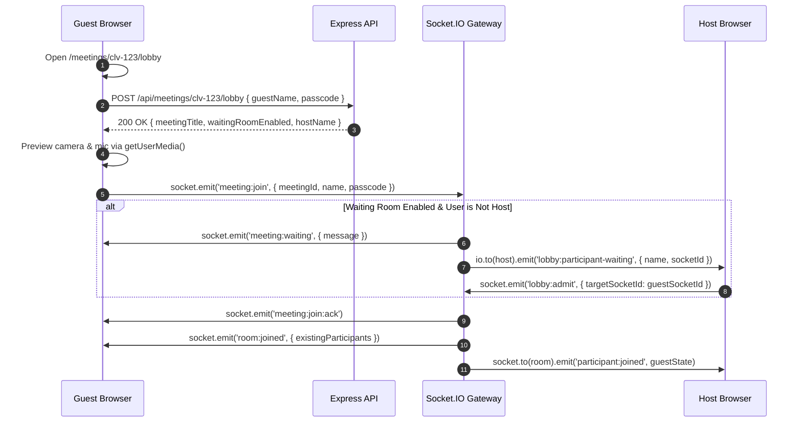

# 17. End-to-End Data Flows & Sequences — CALLIVO

> **CALLIVO — Meet. Connect. Collaborate.**  
> Comprehensive Technical Traces of Platform Workflows

---

## 1. Flow Index
This document traces the exact step-by-step data flow across client, server, database, and peer connections for the 11 primary platform operations.

---

## 2. Flow 1: User Signup Flow



---

## 3. Flow 2: User Login Flow



---

## 4. Flow 3: Dashboard Initial Load Flow

1. Browser requests `/dashboard`.
2. React Router mounts `<AppLayout />`, which executes `authStore.loadUser()`.
3. `loadUser()` reads `callivo_token` from `localStorage` and sends `GET /api/users/me`.
4. The server's `authenticateToken` middleware verifies the JWT, and the controller returns the user's profile and active settings.
5. `DashboardPage.tsx` concurrently dispatches three API requests:
   - `GET /api/meetings`: Loads user's upcoming and recent meetings.
   - `GET /api/contacts`: Loads the address book and active online friends.
   - `GET /api/calendar?month=YYYY-MM`: Loads scheduled events for the current month.
6. Zustand stores (`meetingStore`, `contactsStore`, `calendarStore`) populate, rendering the interactive dashboard view.

---

## 5. Flow 4: Create Meeting Flow

1. User clicks **"Create Instant Meeting"** on the dashboard or fills out the form on `/schedule`.
2. Client issues `POST /api/meetings` with payload:
   ```json
   {
     "title": "Engineering Architecture Review",
     "scheduledAt": "2026-09-15T10:00:00.000Z",
     "passcode": "849218",
     "waitingRoom": true,
     "muteOnEntry": true
   }
   ```
3. Server generates a unique human-friendly meeting ID (e.g., `clv-849-2180`).
4. Prisma writes the `Meeting` record to PostgreSQL, linking it to the authenticated user's `hostId`.
5. If participants were invited by email, creates `MeetingInvite` records and optional `CalendarEvent` entries.
6. Returns `201 Created { meeting }`.
7. Client transitions directly to `/room/clv-849-2180` or displays the invite link modal.

---

## 6. Flow 5: Join Meeting & Lobby Flow



---

## 7. Flow 6: Two-User WebRTC P2P Connection Flow

1. **Discovery:** User B joins an existing room where User A is already present.
2. **Signal:** Server emits `room:joined` to User B (listing User A) and `participant:joined` to User A (announcing User B).
3. **Offer Generation (User B):**
   - User B initializes `RTCPeerConnection` with `max-bundle` and `rtcp-mux`.
   - Adds audio and video transceivers with `direction: 'sendrecv'`.
   - Calls `createOffer()`, sets `setLocalDescription(offer)`.
   - Emits `webrtc:offer` to the server targeting User A.
4. **Answer Generation (User A):**
   - User A receives `webrtc:offer` from the server.
   - User A calls `setRemoteDescription(offer)`.
   - Finds the audio transceiver generated by the offer, attaches local mic track, sets `direction: 'sendrecv'`.
   - Calls `createAnswer()`, sets `setLocalDescription(answer)`.
   - Emits `webrtc:answer` to the server targeting User B.
5. **Answer Acceptance (User B):**
   - User B receives `webrtc:answer` and calls `setRemoteDescription(answer)`.
6. **ICE Exchange:**
   - Both browsers emit `webrtc:ice-candidate` events as network paths are evaluated.
   - Both browsers call `pc.addIceCandidate(candidate)`.
7. **Connected State:** `pc.connectionState` transitions to `'connected'`. Direct P2P media flows.

---

## 8. Flow 7: Audio Transmission Pipeline

1. **Hardware Capture:** User speaks into microphone; browser OS digitizes audio.
2. **Local Processing:** `getUserMedia` applies acoustic echo cancellation, noise suppression, and automatic gain control.
3. **Encoding & RTP:** Browser encodes audio stream using the Opus codec at 48kHz stereo, chunking audio into 20ms RTP packets.
4. **Encryption:** RTP packets are encrypted using DTLS-SRTP session keys.
5. **Transmission:** Encrypted UDP packets travel directly across the P2P connection to the remote peer's public IP (or TURN relay).
6. **Decryption & Decoding:** Remote peer decrypts SRTP packets and decodes Opus audio.
7. **Playback:** Remote track fires `pc.ontrack`. CALLIVO routes the track into the persistent DOM `<audio>` tag and the Web Audio API `AudioContext.destination` sink, driving the physical speakers.

---

## 9. Flow 8: Video Transmission Pipeline

1. **Camera Capture:** Web camera captures 720p 30fps frames.
2. **Local Canvas/Preview:** Attached to local video element via `srcObject`.
3. **Encoding & Packetization:** Encoded with VP8/H.264; dynamically adjusts bitrate based on network bandwidth estimates (Google Congestion Control / GCC).
4. **Network Flow:** Packets travel over UDP to remote peer.
5. **Remote Arrival:** Remote peer's `ontrack` triggers; creates a fresh `MediaStream` reference.
6. **Rendering:** Bound to remote `ParticipantTile.tsx` `<video>` tag with `autoPlay playsInline`, playing smoothly at 60fps.

---

## 10. Flow 9: Screen Sharing Flow

1. User clicks **"Share Screen"** on `MeetingControls.tsx`.
2. Browser displays native screen picker via `navigator.mediaDevices.getDisplayMedia({ video: true })`.
3. User selects window or full desktop.
4. `WebRTCManager` iterates through all active peer connections, locates the video sender (`pc.getSenders()`), and invokes `sender.replaceTrack(screenTrack)`.
5. Emits `media:toggle-screen { isScreenSharing: true }` via Socket.IO.
6. Remote peers' video tiles immediately switch from camera video to high-resolution desktop video without connection interruption.
7. When user clicks "Stop Sharing", `screenTrack.onended` triggers, calling `sender.replaceTrack(cameraTrack)` to smoothly restore camera video.

---

## 11. Flow 10: In-Call Public & Private Chat Flow

1. User types message in `ChatDrawer.tsx` and presses Enter.
2. Client emits `chat:message` to the signaling gateway:
   ```json
   {
     "meetingId": "clv-849-2180",
     "message": "Can everyone see my slides?",
     "senderName": "Alex Mercer",
     "toSocketId": null
   }
   ```
3. **If Public:** Server broadcasts `chat:message` to `room:clv-849-2180`.
4. **If Private:** Server emits `chat:message` strictly to `toSocketId` and echoes back to sender socket.
5. Recipients' `chatStore` receives the message. If the chat drawer is closed, increments `unreadCount` by 1, illuminating the badge on `MeetingControls.tsx`.

---

## 12. Flow 11: Logout Flow

1. User clicks **"Log Out"** in the sidebar profile menu.
2. Client executes `authStore.logout()`.
3. Dispatches `POST /api/auth/logout` to clear the `refreshToken` cookie on the server.
4. Client terminates the active Socket.IO connection (`disconnectSocket()`).
5. Clears `callivo_token` and `callivo_user` from browser `localStorage`.
6. Resets all Zustand stores to initial empty state.
7. Redirects the browser to `/login`.
