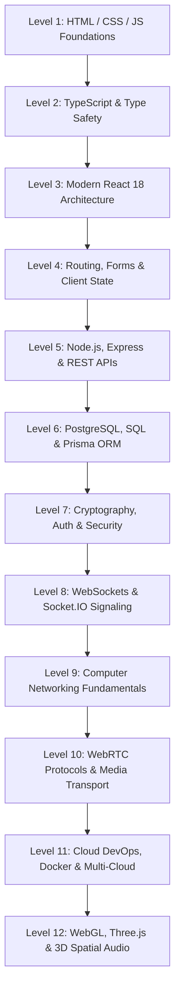

# 21. Engineering Curriculum & Mastery Roadmap (Levels 1–12) — CALLIVO

> **CALLIVO — Meet. Connect. Collaborate.**  
> Structured Self-Study Curriculum to Master Full-Stack Real-Time Systems

---

## 1. Roadmap Architecture Overview

This roadmap is designed to take a computer science student or software engineer from foundational web literacy to deep architectural mastery of real-time distributed WebRTC conferencing.

---

## Level 1: HTML, CSS & JavaScript Foundations

### What to Learn:
- Semantic HTML5 elements (`<video>`, `<audio>`, `<main>`, `<dialog>`).
- Modern JavaScript (ES6+): Promises, `async`/`await`, Closures, Array methods (`map`, `filter`, `reduce`), Event loop, DOM manipulation.
- CSS layout systems: Flexbox, CSS Grid, media queries, CSS variables.

### Why CALLIVO Uses It:
- WebRTC attaches media tracks directly to HTML5 `<video>` and `<audio>` elements.
- Media streams and asynchronous device permissions rely on native JavaScript Promises.

### Interview Checkpoint:
- *Can you explain the JavaScript Event Loop, Call Stack, and Microtask Queue?*
- *How does `async/await` handle errors compared to `.then().catch()`?*

---

## Level 2: TypeScript & Static Typing

### What to Learn:
- Primitive types, interfaces, type aliases, union types, generics.
- Strict null checks, optional chaining (`?.`), nullish coalescing (`??`).
- Typing DOM elements (`HTMLVideoElement`, `HTMLAudioElement`).

### Why CALLIVO Uses It:
- Eliminates bugs when passing complex objects between WebSockets, WebRTC callbacks, and React components.
- Guarantees type contracts across the monorepo (`ParticipantState`, `ConnectionStats`).

### Interview Checkpoint:
- *What is the difference between `interface` and `type` in TypeScript?*
- *What are Generics and how did you use them in `apiRequest<T>()`?*

---

## Level 3: Modern React 18 Architecture

### What to Learn:
- React component lifecycle, Virtual DOM, JSX reconciliation.
- Core hooks: `useState`, `useEffect`, `useRef`, `useMemo`, `useCallback`.
- Context API vs. Component composition.

### Why CALLIVO Uses It:
- Builds responsive, component-driven user interfaces that update cleanly when participants join, leave, or mute.
- Uses `useRef` to maintain persistent references to `<video>` and `<audio>` DOM nodes without triggering re-renders.

### Interview Checkpoint:
- *Why is `useRef` preferred over `useState` for holding a `<video>` tag reference?*
- *What is the difference between controlled and uncontrolled components?*

---

## Level 4: Client State, Routing & Form Validation

### What to Learn:
- **Client Routing:** React Router v6, dynamic route parameters (`:id`), layouts, navigation guards.
- **State Management:** Zustand, atomic selectors, subscribing to state outside components.
- **Forms & Validation:** React Hook Form, uncontrolled inputs, Zod schema validation.

### Why CALLIVO Uses It:
- React Router manages meeting lobbies (`/meetings/:id/lobby`) and rooms (`/room/:id`).
- Zustand enables raw WebRTC callbacks (`pc.ontrack`) to mutate UI state outside React's render loop.
- Zod validates login and scheduling forms before sending network requests.

### Interview Checkpoint:
- *Why did you choose Zustand over Redux or React Context for this project?*
- *How does React Router achieve single-page navigation without reloading the page?*

---

## Level 5: Node.js, Express & REST APIs

### What to Learn:
- Node.js event-driven, non-blocking I/O model.
- Express application architecture: middleware pipeline, routers, controllers, services.
- HTTP request/response cycle, status codes (200, 201, 400, 401, 403, 404, 500).
- Centralized error handling.

### Why CALLIVO Uses It:
- Provides the robust HTTP REST API layer for authenticating users, managing meetings, and handling support tickets.
- Implements security middleware (Helmet, CORS, rate limiting).

### Interview Checkpoint:
- *Explain the difference between authentication (401) and authorization (403).*
- *How does an Express middleware pipeline process an incoming request?*

---

## Level 6: PostgreSQL, SQL & Prisma ORM

### What to Learn:
- Relational database principles: primary keys, foreign keys, one-to-many and many-to-many relationships.
- ACID properties (Atomicity, Consistency, Isolation, Durability).
- Object-Relational Mapping (ORM) concepts.
- Prisma schema definition, relations, migrations, and parameterized queries.
- Database connection pooling (PgBouncer).

### Why CALLIVO Uses It:
- Stores 26 relational models in PostgreSQL (Neon) including users, meetings, messages, and audit logs.
- Employs `sync-db-provider.cjs` to dynamically support both local SQLite and cloud PostgreSQL.

### Interview Checkpoint:
- *What is connection pooling and why is it necessary for serverless databases like Neon?*
- *How does an ORM protect against SQL Injection attacks?*

---

## Level 7: Cryptography, Authentication & Web Security

### What to Learn:
- Hashing algorithms vs. Encryption vs. Encoding.
- `bcrypt` adaptive salted password hashing.
- JSON Web Tokens (JWT): structure, signing, claims, expiration.
- Dual-token rotation: short-lived access tokens + long-lived HTTP-only refresh tokens.
- Web security: CORS, XSS, CSRF, Clickjacking, Helmet headers.

### Why CALLIVO Uses It:
- Protects user credentials with 10-round bcrypt hashes.
- Issues 15-minute access tokens and 7-day refresh tokens stored in `HttpOnly`, `Secure` cookies.
- Sanitizes file uploads using binary magic-byte inspection.

### Interview Checkpoint:
- *Why are refresh tokens stored in HTTP-only cookies instead of localStorage?*
- *What is a rainbow-table attack and how does salting prevent it?*

---

## Level 8: WebSockets & Socket.IO Signaling

### What to Learn:
- WebSocket protocol (RFC 6455): full-duplex TCP connections, handshake upgrade.
- WebSockets vs. HTTP long-polling vs. Server-Sent Events (SSE).
- Socket.IO architecture: rooms, namespaces, broadcasting, client acknowledgements.
- Socket authentication middleware.

### Why CALLIVO Uses It:
- Powers the real-time signaling gateway (`server/src/signaling/signaling.gateway.ts`).
- Exchanges SDP offers, answers, and ICE candidates between peers.
- Broadcasts real-time events: chat messages, emoji reactions, and mute states.

### Interview Checkpoint:
- *Why does CALLIVO use Socket.IO for signaling instead of carrying video media?*
- *What happens under the hood during a WebSocket handshake upgrade?*

---

## Level 9: Computer Networking Fundamentals

### What to Learn:
- OSI 7-Layer Model vs. TCP/IP Model.
- TCP (reliable, ordered, connection-oriented) vs. UDP (unreliable, unordered, datagram).
- Head-of-Line Blocking in TCP.
- NAT (Network Address Translation): Full Cone, Restricted Cone, Symmetric NAT.
- Port forwarding, firewalls, and Carrier-Grade NAT (CGNAT).

### Why CALLIVO Uses It:
- Explains why real-time video MUST use UDP (WebRTC) rather than TCP (Socket.IO).
- Essential for understanding why NAT traversal (STUN/TURN) is necessary for peer-to-peer calls.

### Interview Checkpoint:
- *Why does TCP cause audio freezes during packet loss while UDP does not?*
- *What is Symmetric NAT and why does it break direct P2P connections?*

---

## Level 10: WebRTC Protocols & Media Engineering

### What to Learn:
- WebRTC architecture: `RTCPeerConnection`, `MediaStream`, `MediaStreamTrack`.
- `RTCRtpSender`, `RTCRtpReceiver`, and `RTCRtpTransceiver` (`sendrecv`).
- SDP (Session Description Protocol): media lines (`m=`), attributes (`a=`).
- ICE framework, STUN binding requests, TURN allocation relays.
- DTLS cryptographic handshake and SRTP packet encryption.
- Opus audio codec, VP8/H.264 video codecs.
- Web Audio API: `AudioContext`, `AnalyserNode`, `MediaStreamAudioSourceNode`.
- Screen sharing via `getDisplayMedia()` and `replaceTrack()`.

### Why CALLIVO Uses It:
- The core capability of the application: direct browser-to-browser encrypted media streaming.
- Solves browser autoplay restrictions, transceiver conflicts, and early ICE arrival race conditions.

### Interview Checkpoint:
- *Walk me through the complete WebRTC Offer/Answer lifecycle step by step.*
- *How does `replaceTrack()` enable screen sharing without renegotiating the connection?*
- *How did you solve the browser audio autoplay blockade in CALLIVO?*

---

## Level 11: Cloud DevOps, Docker & Multi-Cloud Architecture

### What to Learn:
- Containerization concepts: Docker images, containers, multi-stage Dockerfiles.
- Cloud hosting: Edge CDN hosting (Vercel) vs. Container web services (Render).
- Serverless databases: Neon PostgreSQL, branch management, connection pooling.
- Environment variable segregation (Frontend public variables vs. Backend secrets).
- Continuous Integration & Continuous Deployment (CI/CD) with GitHub webhooks.

### Why CALLIVO Uses It:
- Production deployment across Vercel (`callivo.vercel.app`), Render (`callivo-f1n8.onrender.com`), and Neon.
- Multi-stage Docker container (`Dockerfile`) building both frontend SPA and backend service.

### Interview Checkpoint:
- *Why did you separate the frontend onto Vercel and the backend onto Render?*
- *Why must backend secrets never be prefixed with `VITE_`?*

---

## Level 12: 3D Graphics, WebGL & Spatial Audio

### What to Learn:
- WebGL fundamentals: Canvas, GPU pipeline, vertex shaders, fragment shaders.
- Three.js core concepts: Scene, Camera, Renderer, Meshes, Geometries, Materials, Lights.
- React Three Fiber (R3F): declarative 3D scene graphs in React.
- `@react-three/drei` helper primitives (`OrbitControls`, `Float`).
- Mapping HTML5 `<video>` elements to Three.js `VideoTexture` surfaces.

### Why CALLIVO Uses It:
- Renders the interactive 3D landing hero (`Hero3D.tsx`) with floating participant nodes.
- Powers the experimental 3D boardroom (`SpatialMeetingRoom.tsx`) projecting video streams onto virtual panels.

### Interview Checkpoint:
- *How do you project a live HTML5 video stream onto a 3D mesh in Three.js?*
- *What performance considerations exist when running a 3D canvas alongside WebRTC video feeds?*
